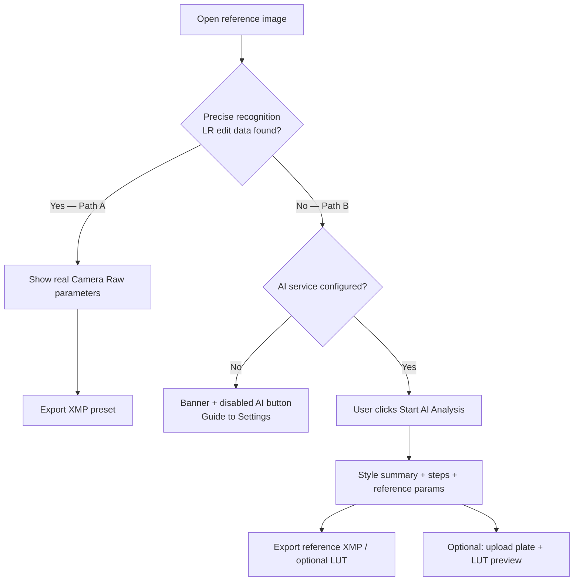

# Lightroom Preset Learner

**English** · [简体中文](README.zh-CN.md)

A desktop app for photography enthusiasts who want to **learn how a Lightroom look was built** — by reading real edit data from exported photos, or with AI-assisted style analysis when that data is unavailable.

> **This is not** a one-click filter app or a consumer “make it pretty” tool. It is a **learning assistant** that helps you understand and reproduce grading decisions inside Lightroom.

---

## Table of Contents

- [Background](#background)
- [Goals](#goals)
- [How It Works](#how-it-works)
- [Quick Start](#quick-start)
- [Documentation](#documentation)
- [Project Structure](#project-structure)
- [Version History: v1 → v2](#version-history-v1--v2)
- [Current Limitations](#current-limitations)
- [Roadmap](#roadmap)
- [Privacy & Cost](#privacy--cost)
- [License](#license)

---

## Background

When photographers export finished images from **Adobe Lightroom**, some files still carry **embedded Camera Raw / Lightroom edit metadata** (XMP). That metadata contains the **actual slider values** used in Develop — ground truth for learning.

Many shared images (social media re-exports, screenshots, stripped JPEGs) **no longer contain** that data. Classic “reverse engineering” via global image statistics (histogram heuristics) often produces **misleading parameters**.

This project started as a **PyQt6 + OpenCV prototype** that guessed LR sliders from pixel statistics. **v2** reframed the product around two honest paths: **precise recognition** when metadata exists, and **AI-assisted reference analysis** when it does not.

---

## Goals

| Goal | Description |
|------|-------------|
| **Learn, don’t auto-magic** | Show *how* a look was built — grouped parameters, AI narrative, export only when the user confirms |
| **Precise when possible** | Path A reads real CRS/XMP fields from Lightroom exports — no API required |
| **Honest when not** | Path B labels AI output as *reference / suggested* parameters, not ground truth |
| **Stay lightweight** | Simpler than Lightroom; dark photography-tool UI; one primary toolbar |
| **Safe by default** | Analysis stays in memory until the user clicks **Export**; local AI config is gitignored |

**Success criteria:** A user can open an LR-exported JPG, see real or AI-reference parameters with clear visual distinction, export an XMP preset, and optionally preview a LUT on their own unedited plate (Path B).

---

## How It Works



### Two paths (user-facing terms)

| | **Path A — Precise recognition** | **Path B — AI-assisted learning** |
|---|-----------------------------------|-------------------------------------|
| **Trigger** | LR edit metadata detected in JPG/TIFF or sidecar `.xmp` | Metadata not found |
| **Output** | Exact CRS parameters | AI style narrative + reference parameters |
| **API** | Not required | OpenAI-compatible Vision API (user’s own key) |
| **Export** | XMP (LUT optional in dialog) | Reference XMP / optional `.cube` LUT |
| **Plate preview** | Hidden (not needed) | Available after AI analysis |

---

## Quick Start

### Requirements

- **Python 3.10+**
- **Windows** (primary; `run.bat` provided)
- macOS / Linux: use manual steps below

### Run on Windows

```bat
run.bat
```

`run.bat` will create `venv`, install dependencies, run a UI sanity check, and start the app.

### Manual setup

```bash
python -m venv venv
# Windows: venv\Scripts\activate
# macOS/Linux: source venv/bin/activate
pip install -r requirements.txt
python main.py
```

### AI configuration (Path B only)

1. Copy the example config:
   ```bash
   copy config\ai_config.example.yaml config\ai_config.local.yaml   # Windows
   cp config/ai_config.example.yaml config/ai_config.local.yaml     # macOS/Linux
   ```
2. Open the app → **Settings → AI Service**
3. Enter **API Key**, **model name**, and optionally **Base URL** (for compatible gateways)
4. Save and use **Test connection**

> **`config/ai_config.local.yaml` is gitignored** — your keys are not pushed to GitHub.  
> Path A works **without any API key**.

### Supported image formats

JPG / JPEG / PNG / WebP — drag-and-drop or **Open Image**.

---

## Documentation

| Layer | Document | Audience |
|-------|----------|----------|
| **Index** | [`docs/README.md`](docs/README.md) | Doc map: human vs AI vs machine |
| **Product** | [`docs/PRODUCT_SPEC_v2.md`](docs/PRODUCT_SPEC_v2.md) | What the app does |
| **UI / copy** | [`docs/UI_UX_DESIGN.md`](docs/UI_UX_DESIGN.md) | Layout, §11 copy deck |
| **Code** | [`docs/CODE_ARCHITECTURE.md`](docs/CODE_ARCHITECTURE.md) | Modules, Path A/B call chains |
| **AI / prompts** | [`docs/AI_ARCHITECTURE.md`](docs/AI_ARCHITECTURE.md) | Provider, prompt SOP, changelog |
| **JSON contract** | [`docs/AI_RESPONSE_SCHEMA.md`](docs/AI_RESPONSE_SCHEMA.md) + [`schemas/`](schemas/) | Path B response shape |
| **Coding agents** | [`AGENTS.md`](AGENTS.md) + [`.cursor/rules/`](.cursor/rules/) | Short rules for AI tools |
| **Runtime copy** | [`gui/copy.py`](gui/copy.py) | Must match UI doc §11 |

**UI version:** check window title — e.g. `Lightroom Preset Learner (UI 1.6.0)`.

---

## Project Structure

```
lightroom_preset_generator/
├── ai/                  # OpenAI-compatible Vision provider, schema, service
├── analyzers/           # v1 rule-based estimators (legacy; not main path in v2)
├── config/              # App settings, AI config (example + local)
├── core/                # Metadata detector/parser, session model, pipeline
├── docs/                # Product spec + UI/UX design
├── generators/          # XMP preset writer
├── gui/                 # PyQt6 main window, widgets, dialogs, QSS theme
├── lut/                 # Local LUT bake + apply for plate preview
├── preview/             # OpenCV preset simulator (legacy helper)
├── scripts/             # verify_ui.py — preflight before launch
├── main.py              # Entry point
└── run.bat              # Windows launcher
```

---

## Version History: v1 → v2

### At a glance

| | **v1** (`673ef82` — Initial commit) | **v2** (`179865a` — dual-path refactor) |
|---|--------------------------------------|------------------------------------------|
| **Core idea** | 10 rule analyzers guess LR sliders from pixels | Metadata-first + optional AI |
| **Accuracy** | Heuristic guesses | Real XMP when available |
| **AI** | None | OpenAI-compatible Vision API |
| **Export** | XMP | XMP + optional `.cube` LUT |
| **GUI** | Basic list + preview | StatusCard, learning panel, settings/export dialogs, dark QSS |
| **Plate preview** | None | Left-column plate + LUT preview (UI v1.6) |
| **Docs** | None in repo | ~1,700 lines product + UI specs |
| **Lines changed** | 28 files, ~1,722 insertions | +33 files touched, +4,147 / −326 vs v1 |

### Git commits

```
673ef82  Initial commit: Lightroom preset generator
179865a  feat: v2 dual-path refactor with AI learning, metadata extraction, and UI v1.6
```

<details>
<summary>v2 commit — file summary (<code>git diff 673ef82..179865a --stat</code>)</summary>

```
 ai/                          NEW — AI provider layer
 core/metadata_*.py          NEW — XMP / sidecar detection & parsing
 gui/copy.py, workers.py     NEW — copy deck, background workers
 gui/styles/app_dark.qss     NEW — dark theme
 lut/                         NEW — LUT generation & preview
 docs/PRODUCT_SPEC_v2.md     NEW — product specification
 docs/UI_UX_DESIGN.md        NEW — UI/UX + copy deck
 gui/main_window.py          MAJOR — dual-path UI, plate preview v1.6
 gui/widgets.py              MAJOR — StatusCard, ImageZone, learning panel
 config/ai_config.*          NEW — local AI settings (example only in git)
 scripts/verify_ui.py        NEW — startup UI version check
```

</details>

---

## Current Limitations

### Product & experience

- **LUT preview is approximate** — baked locally from simplified formulas, not Adobe’s rendering engine. Visual match to Lightroom will differ; XMP remains the authoritative learning output.
- **AI parameters are references, not truth** — Path B output is labeled *AI reference analysis*; users should validate and tweak in Lightroom.
- **Single-image workflow** — no batch import, folder watch, or catalog integration.
- **Chinese UI** — interface copy is Chinese-first; documentation is bilingual (README) + Chinese product specs.
- **Plate preview only on Path B** — after AI produces a LUT; Path A hides the plate section by design.

### Technical

- **Metadata parsing coverage** — embedded XMP and sidecar `.xmp` supported; edge cases (partial CRS, unusual exports) may need more real-world samples. ExifTool fallback is planned, not shipped.
- **Legacy analyzers still in repo** — `analyzers/` from v1 remains for reference/debug but is **not** the primary v2 pipeline.
- **AI JSON fragility** — depends on model following schema; retries and strict parsing help but cannot guarantee 100% stability.
- **Platform polish** — `run.bat` is Windows-focused; other OS paths are manual.
- **No automated test suite or CI** — quality relies on manual acceptance scenarios in the product spec.

### Engineering

- **No LICENSE file yet** — usage terms undefined for redistribution.
- **Product spec status lag** — `PRODUCT_SPEC_v2.md` still marks some items “pending” while UI v1.6 is already implemented; README reflects actual pushed code.

---

## Roadmap

Priorities aligned with [`docs/PRODUCT_SPEC_v2.md`](docs/PRODUCT_SPEC_v2.md):

### Near term (P1)

- [ ] Broader metadata compatibility testing + ExifTool fallback
- [ ] Export / AI error handling hardening
- [ ] Light theme or appearance toggle (spec §7.4 P2)
- [ ] README screenshots and short demo GIF

### Medium term (P2)

- [ ] Batch analysis for folders
- [ ] Optional non–OpenAI-compatible providers (e.g. native Claude API)
- [ ] Automated tests for metadata parser and XMP generator
- [ ] CI workflow (lint + smoke test on Windows)

### Longer term

- [ ] Plugin or sidecar workflow with Lightroom Classic
- [ ] Confidence calibration for AI-suggested “adjust first” parameters
- [ ] English UI locale (strings already keyed in `gui/copy.py`)

---

## Privacy & Cost

| Path | Network | Cost |
|------|---------|------|
| **A — Precise recognition** | Fully local | Free |
| **B — AI analysis** | Image uploaded to **your configured API endpoint** | Billed by your provider (OpenAI, Zhipu, compatible gateway, etc.) |

Configure API keys only in **Settings** or `config/ai_config.local.yaml`. Read your provider’s privacy policy before analyzing client work.

**Cursor / IDE subscriptions do not replace an API key** for Path B in this app.

---

## License

No license file is included yet. All rights reserved by the repository owner until a license is added. Contact the maintainer before redistribution.

---

## Troubleshooting

| Issue | Suggestion |
|-------|------------|
| Old UI after update | Delete `gui/__pycache__`, restart via `run.bat` |
| “AI not configured” banner | Expected on Path B without API key; Path A still works |
| `verify_ui.py` fails | Ensure `config/settings.py` `ui_version` matches widgets docstring |
| Push / git ignored secrets | Never commit `config/ai_config.local.yaml` — use the example file only |

---

<p align="center">
  <sub>Lightroom is a trademark of Adobe Inc. This project is not affiliated with Adobe.</sub>
</p>
