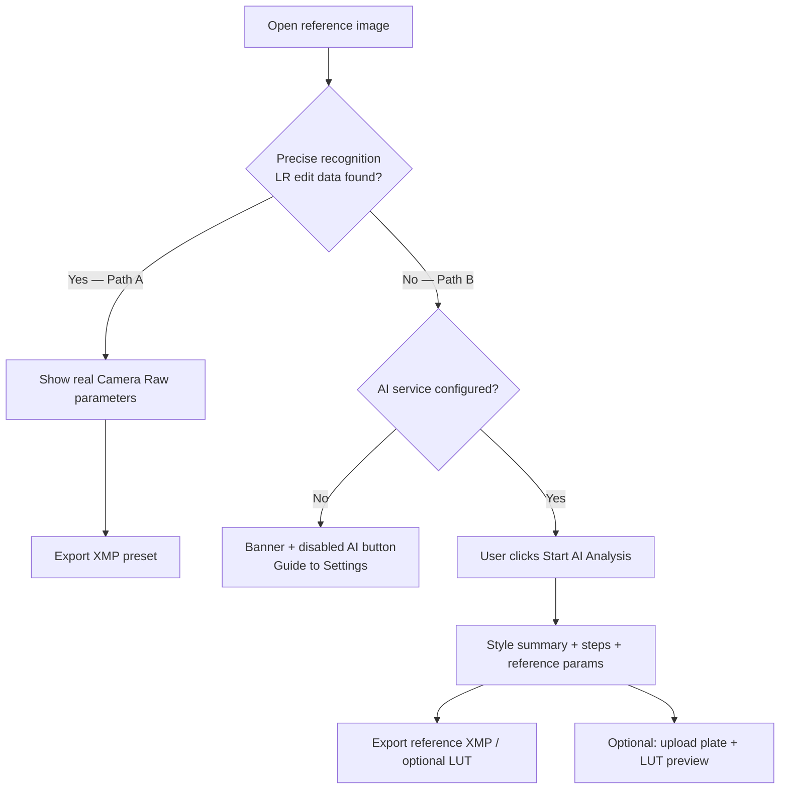

# Lightroom Preset Learner

**English** · [简体中文](README.zh-CN.md)

A desktop app for photography enthusiasts who want to **learn how a Lightroom look was built** — by reading real edit data from exported photos, or with AI-assisted style analysis when that data is unavailable.

> **This is not** a one-click filter app or a consumer “make it pretty” tool. It is a **learning assistant** that helps you understand and reproduce grading decisions inside Lightroom.

---

## Current Status (July 2026)

| Area | Status |
|------|--------|
| **Path A — Precise recognition** | Shipped — embedded XMP + sidecar `.xmp` → real CRS parameters → XMP export |
| **Path B — AI learning** | Shipped — OpenAI-compatible Vision API, user-triggered analysis, reference XMP / optional LUT |
| **AI schema** | **`style_analysis.v1.1`** — 11 core sliders (§7a) + 24 sparse optional color keys (§7b) for richer XMP |
| **Provider setup** | Settings presets: **OpenAI**, **Volcengine Ark (Doubao)**, **Custom** — auto-fill Base URL; still one protocol (`/chat/completions`) |
| **Plate LUT preview** | UI **v1.6** — left column only |
| **UI theme** | Dark QSS (L1), StatusCard, learning panel, export/settings dialogs |
| **Verification** | `scripts/verify_ui.py`, `scripts/verify_ai_schema.py` |

**Not yet:** batch workflow, ExifTool fallback, automated test suite / CI, English UI locale, LICENSE file.

---

## Table of Contents

- [Current Status](#current-status-july-2026)
- [Background](#background)
- [Goals](#goals)
- [How It Works](#how-it-works)
- [Screenshots & Effect Showcase](#screenshots--effect-showcase)
- [AI-Assisted Analysis (Prompt)](#ai-assisted-analysis-prompt)
- [Quick Start](#quick-start)
- [Documentation Guide](#documentation-guide)
- [Project Structure](#project-structure)
- [Version History: v1 → v2](#version-history-v1--v2)
- [Current Limitations](#current-limitations)
- [Roadmap](#roadmap)
- [Privacy & Cost](#privacy--cost)
- [License](#license)

---

## Background

When photographers export finished images from **Adobe Lightroom**, some files still carry **embedded Camera Raw / Lightroom edit metadata** (XMP). That metadata contains the **actual slider values** used in Develop — ground truth for learning.

Many shared images (social media re-exports, screenshots, stripped JPEGs) **no longer contain** that data. Classic “reverse engineering” via global image statistics (histogram heuristics) often produces **misleading parameters**.

This project started as a **PyQt6 + OpenCV prototype** that guessed LR sliders from pixel statistics. **v2** reframed the product around two honest paths: **precise recognition** when metadata exists, and **AI-assisted reference analysis** when it does not.

---

## Goals

| Goal | Description |
|------|-------------|
| **Learn, don’t auto-magic** | Show *how* a look was built — grouped parameters, AI narrative, export only when the user confirms |
| **Precise when possible** | Path A reads real CRS/XMP fields from Lightroom exports — no API required |
| **Honest when not** | Path B labels AI output as *reference / suggested* parameters, not ground truth |
| **Stay lightweight** | Simpler than Lightroom; dark photography-tool UI; one primary toolbar |
| **Safe by default** | Analysis stays in memory until the user clicks **Export**; local AI config is gitignored |

**Success criteria:** A user can open an LR-exported JPG, see real or AI-reference parameters with clear visual distinction, export an XMP preset, and optionally preview a LUT on their own unedited plate (Path B).

---

## How It Works



### Two paths (user-facing terms)

| | **Path A — Precise recognition** | **Path B — AI-assisted learning** |
|---|-----------------------------------|-------------------------------------|
| **Trigger** | LR edit metadata detected in JPG/TIFF or sidecar `.xmp` | Metadata not found |
| **Output** | Exact CRS parameters | AI style narrative + reference parameters |
| **API** | Not required | OpenAI-compatible Vision API (user’s own key) |
| **Export** | XMP (LUT optional in dialog) | Reference XMP / optional `.cube` LUT |
| **Plate preview** | Hidden (not needed) | Left column only; after AI analysis |

> **Path B note (AI call path):** Path B is the **AI invocation pipeline** — not a separate app. After precise recognition fails, the user must click **Start AI Analysis**; the app then runs a background worker that loads the system prompt, calls your OpenAI-compatible Vision API, validates JSON against **`style_analysis.v1.1`**, and optionally bakes an in-memory LUT for plate preview. See [Path B — AI call chain](#path-b--ai-call-chain-developer-note) and [`docs/AI_ARCHITECTURE.md`](docs/AI_ARCHITECTURE.md).

### Path B — AI call chain (developer note)

Path B = **未能精确识别** in user-facing copy. In code it is `AnalysisMode.AI_LEARNING`.

```
gui/main_window.run_ai_analysis()
  └─ gui/workers.AiAnalysisWorker
       ├─ config/ai_config.load_ai_config()
       ├─ ai/factory.create_analyzer()
       │    └─ ai/openai_compatible_provider.analyze()
       │         ├─ read config/prompts/style_analysis.txt (or .en.txt)
       │         ├─ HTTP Vision API (image + system prompt)
       │         ├─ ai/response_parser.parse_json_content()
       │         └─ ai/validator.normalize_style_analysis()
       ├─ ai/service.style_result_to_report()
       └─ ai/service.build_lut_for_report() → lut/lut_generator (optional cube)
```

| Stage | Primary files | Document |
|-------|---------------|----------|
| Trigger & thread | `gui/main_window.py`, `gui/workers.py` | [`CODE_ARCHITECTURE.md`](docs/CODE_ARCHITECTURE.md) |
| API & prompt | `ai/openai_compatible_provider.py`, `config/prompts/` | [`AI_ARCHITECTURE.md`](docs/AI_ARCHITECTURE.md) |
| JSON contract | `ai/validator.py`, `ai/parameter_registry.py`, `schemas/` | [`AI_RESPONSE_SCHEMA.md`](docs/AI_RESPONSE_SCHEMA.md) |
| Prompt change log | `config/prompts/*.txt` | [`PROMPT_CHANGELOG.md`](docs/PROMPT_CHANGELOG.md) |
| LUT preview | `lut/lut_generator.py`, `lut/lut_applier.py` | [`AI_ARCHITECTURE.md`](docs/AI_ARCHITECTURE.md) §6 |

**To change Path B behavior in Cursor:** `@docs/AI_ARCHITECTURE.md` (flow + SOP) · `@docs/PROMPT_CHANGELOG.md` (if editing prompts) · `@docs/AI_RESPONSE_SCHEMA.md` (if changing JSON fields).

---

## Screenshots & Effect Showcase

Want to see the UI before installing? Open the **[User Guide → `interface/GUIDEBOOK.md`](interface/GUIDEBOOK.md)** — it walks through the main window, export dialog, AI settings, and includes a real **before / after** effect comparison with screenshots.

[](interface/GUIDEBOOK.md#11-效果展示)

The guide covers everyday workflows: opening a reference image, reading AI learning output, exporting a preset, and previewing LUT on your own plate. The effect section shows a **film-style meadow reference** analyzed by AI, exported as XMP, then applied in Lightroom to a beach RAW — achieving a similar color mood and tone to the reference.

---

## AI-Assisted Analysis (Prompt)

Path B sends the reference image to your configured **OpenAI-compatible Vision API** together with a fixed system prompt ([`config/prompts/style_analysis.txt`](config/prompts/style_analysis.txt) / [`.en.txt`](config/prompts/style_analysis.en.txt)). The model must return a single JSON object validated as **`style_analysis.v1.1`**.

### What the prompt encodes

The prompt acts as a **color-grading tutor**, not a one-click filter recipe. Its core ideas:

| Layer | Content |
|-------|---------|
| **Scene taxonomy** | Classify each image first as **portrait (P)**, **landscape (L)**, or **mixed (M)**, then pick a subtype (e.g. golden hour, studio, blue hour, night neon, astro, snow, environmental portrait) |
| **Category-specific workflow** | Different observation checklists and reference value bands for portraits vs landscapes — skin and face drive WB/exposure on portraits; sky/terrain drive grading on landscapes |
| **Structured narrative** | `overall_impression` (with `【category/subtype/light】` tag), `editing_steps` (step 1 always **scene recognition**), `priority_adjustments` (3–5 slider names in suggested order) |
| **§7a — 11 core sliders** | Exposure, Contrast, Highlights, Shadows, Whites, Blacks, Temperature, Tint, Saturation, Vibrance, Clarity — **all required**, with plausible non-zero values |
| **§7b — color extension (sparse)** | Optional split toning, color grading wheels, targeted HSL (skin/sky/grass/water), vignette, grain — only when the look clearly needs them, for richer **XMP** export |

### What Path B can deliver today

- **Readable learning copy** — why the reference looks the way it does, and in what order to adjust sliders in Lightroom  
- **Reference parameters with confidence** — grouped in the learning panel; exportable as **XMP preset** for import into Lightroom Classic  
- **Global LUT preview** — local before/after on your own plate from the six global keys used in LUT bake (exposure, contrast, WB, saturation, clarity)  
- **Broad style coverage** — natural light, film-like low saturation, golden hour, night city / neon, astro, snow, mixed environmental portraits, and similar looks where global grading is the main story  

Prompt change history: [`docs/PROMPT_CHANGELOG.md`](docs/PROMPT_CHANGELOG.md) · JSON contract: [`docs/AI_RESPONSE_SCHEMA.md`](docs/AI_RESPONSE_SCHEMA.md) · implementation: [`docs/AI_ARCHITECTURE.md`](docs/AI_ARCHITECTURE.md)

---

## Quick Start

### Requirements

- **Python 3.10+**
- **Windows** (primary; `run.bat` provided)
- macOS / Linux: use manual steps below

### Run on Windows

```bat
run.bat
```

`run.bat` will create `venv`, install dependencies, run a UI sanity check, and start the app.

### Manual setup

```bash
python -m venv venv
# Windows: venv\Scripts\activate
# macOS/Linux: source venv/bin/activate
pip install -r requirements.txt
python main.py
```

### AI configuration (Path B only)

1. Copy the example config:
   ```bash
   copy config\ai_config.example.yaml config\ai_config.local.yaml   # Windows
   cp config/ai_config.example.yaml config/ai_config.local.yaml     # macOS/Linux
   ```
2. Open the app → **Settings → AI Service**
3. Choose a **provider preset** (optional helper — still OpenAI-compatible `chat/completions`):

   | Preset | Base URL (auto-filled) | Model field |
   |--------|------------------------|-------------|
   | OpenAI | `https://api.openai.com/v1` | e.g. `gpt-4o` |
   | Volcengine Ark | `https://ark.cn-beijing.volces.com/api/v3` | **Model ID** or `ep-…` endpoint (vision-capable) |
   | Custom | You enter URL | Per your gateway docs |

4. Enter **API Key** and **model**; save and use **Test connection**

> **Volcengine users:** use `/api/v3`, not Anthropic `/api/compatible` URLs from other tools.  
> **`config/ai_config.local.yaml` is gitignored** — your keys are not pushed to GitHub.  
> Path A works **without any API key**.

### Supported image formats

JPG / JPEG / PNG / WebP — drag-and-drop or **Open Image**.

---

## Documentation Guide

This README is the **public intro**. For day-to-day work, open the doc that matches your task — in Cursor you can `@`-mention the file path directly.

**Full layer map (human vs AI vs machine):** [`docs/README.md`](docs/README.md)

### All documents and responsibilities

| Document | Type | Responsible for |
|----------|------|-----------------|
| [`README.md`](README.md) | Entry · EN | Public overview, install, Path A/B summary, **this index** |
| [`README.zh-CN.md`](README.zh-CN.md) | Entry · ZH | Same as above in Chinese |
| [`interface/GUIDEBOOK.md`](interface/GUIDEBOOK.md) | Guide · ZH | **User guide** with UI screenshots for GitHub browsing |
| [`docs/README.md`](docs/README.md) | Index | L0–L5 doc layers; what is human-read vs AI-read vs machine-read |
| [`docs/PRODUCT_SPEC_v2.md`](docs/PRODUCT_SPEC_v2.md) | Human · product | Features, Path A/B requirements, acceptance tests, risks — **what the app should do** |
| [`docs/UI_UX_DESIGN.md`](docs/UI_UX_DESIGN.md) | Human · UI | Layout, state machine, components, dark theme; **§11 copy deck** — **how the UI looks and reads** |
| [`docs/CODE_ARCHITECTURE.md`](docs/CODE_ARCHITECTURE.md) | Human · code | Module map, Path A/B call chains, config, export — **how the whole codebase is wired** |
| [`docs/AI_ARCHITECTURE.md`](docs/AI_ARCHITECTURE.md) | Human · AI | Path B / **AI call path**, Provider, prompt loading, validation, **prompt change SOP** |
| [`docs/AI_RESPONSE_SCHEMA.md`](docs/AI_RESPONSE_SCHEMA.md) | Human · contract | JSON field definitions, LUT/XMP routing, errors, schema versioning |
| [`docs/PROMPT_CHANGELOG.md`](docs/PROMPT_CHANGELOG.md) | Human · audit | **Prompt change history** — why each prompt edit was made |
| [`AGENTS.md`](AGENTS.md) | AI · entry | Short agent orientation: key paths, checklists, links to docs |
| [`.cursor/rules/project-context.mdc`](.cursor/rules/project-context.mdc) | AI · rule | Always-on: product positioning, doc pointers, UI v1.6.2 plate layout |
| [`.cursor/rules/ai-module.mdc`](.cursor/rules/ai-module.mdc) | AI · rule | When editing `ai/`, `prompts/`, `schemas/` — mandatory sync files |
| [`.cursor/rules/ui-copy.mdc`](.cursor/rules/ui-copy.mdc) | AI · rule | When editing `gui/` — copy must follow UI §11 |
| [`schemas/style_analysis.v1.1.json`](schemas/style_analysis.v1.1.json) | Machine | Active JSON Schema for Path B (`style_analysis.v1.1`; v1 retained for history) |
| [`config/prompts/style_analysis.txt`](config/prompts/style_analysis.txt) | Machine + audit | Runtime system prompt (zh-CN) sent to the Vision API |
| [`config/prompts/style_analysis.en.txt`](config/prompts/style_analysis.en.txt) | Machine + audit | Runtime system prompt (English) |
| [`gui/copy.py`](gui/copy.py) | Runtime | On-screen strings; must match [`UI_UX_DESIGN.md`](docs/UI_UX_DESIGN.md) §11 |

### What to `@` when you want to change…

| Goal | `@` these documents |
|------|---------------------|
| Product behavior, features, acceptance | `docs/PRODUCT_SPEC_v2.md` |
| Layout, buttons, states, user-visible text | `docs/UI_UX_DESIGN.md` (+ sync `gui/copy.py`) |
| Main flow, modules, Path A, export pipeline | `docs/CODE_ARCHITECTURE.md` |
| **Path B / AI API / prompt / JSON validation** | `docs/AI_ARCHITECTURE.md` |
| Add or change AI response fields | `docs/AI_RESPONSE_SCHEMA.md` + `schemas/` + `ai/parameter_registry.py` |
| Edit prompt wording or tone | `config/prompts/` + **`docs/PROMPT_CHANGELOG.md`** |
| Let Cursor follow repo conventions | `AGENTS.md` |

### Verification scripts

| Script | When to run |
|--------|-------------|
| [`scripts/verify_ui.py`](scripts/verify_ui.py) | After GUI / layout changes |
| [`scripts/verify_ai_schema.py`](scripts/verify_ai_schema.py) | After AI schema, registry, or validator changes |

**UI version:** window title — e.g. `Lightroom Preset Learner (UI 1.6.0)`.

---

## Project Structure

```
lightroom_preset_generator/
├── ai/                  # OpenAI-compatible Vision provider, schema, service
├── analyzers/           # v1 rule-based estimators (legacy; not main path in v2)
├── config/              # App settings, AI config, provider presets, prompts
├── core/                # Metadata detector/parser, session model, pipeline
├── docs/                # Product spec + UI/UX design
├── generators/          # XMP preset writer
├── gui/                 # PyQt6 main window, widgets, dialogs, QSS theme
├── lut/                 # Local LUT bake + apply for plate preview
├── preview/             # OpenCV preset simulator (legacy helper)
├── scripts/             # verify_ui.py — preflight before launch
├── main.py              # Entry point
└── run.bat              # Windows launcher
```

---

## Version History: v1 → v2

### At a glance

| | **v1** (`673ef82` — Initial commit) | **v2** (`179865a` — dual-path refactor) |
|---|--------------------------------------|------------------------------------------|
| **Core idea** | 10 rule analyzers guess LR sliders from pixels | Metadata-first + optional AI |
| **Accuracy** | Heuristic guesses | Real XMP when available |
| **AI** | None | OpenAI-compatible Vision API |
| **Export** | XMP | XMP + optional `.cube` LUT |
| **GUI** | Basic list + preview | StatusCard, learning panel, settings/export dialogs, dark QSS |
| **Plate preview** | None | Left-column plate + LUT preview (UI v1.6) |
| **Docs** | None in repo | ~1,700 lines product + UI specs |
| **Lines changed** | 28 files, ~1,722 insertions | +33 files touched, +4,147 / −326 vs v1 |

### Git commits

```
673ef82  Initial commit: Lightroom preset generator
179865a  feat: v2 dual-path refactor with AI learning, metadata extraction, and UI v1.6
```

<details>
<summary>v2 commit — file summary (<code>git diff 673ef82..179865a --stat</code>)</summary>

```
 ai/                          NEW — AI provider layer
 core/metadata_*.py          NEW — XMP / sidecar detection & parsing
 gui/copy.py, workers.py     NEW — copy deck, background workers
 gui/styles/app_dark.qss     NEW — dark theme
 lut/                         NEW — LUT generation & preview
 docs/PRODUCT_SPEC_v2.md     NEW — product specification
 docs/UI_UX_DESIGN.md        NEW — UI/UX + copy deck
 gui/main_window.py          MAJOR — dual-path UI, plate preview v1.6
 gui/widgets.py              MAJOR — StatusCard, ImageZone, learning panel
 config/ai_config.*          NEW — local AI settings (example only in git)
 scripts/verify_ui.py        NEW — startup UI version check
```

</details>

---

## Current Limitations

### Product & experience

- **LUT preview is approximate** — baked locally from simplified formulas, not Adobe’s rendering engine. Visual match to Lightroom will differ; XMP remains the authoritative learning output.
- **AI parameters are references, not truth** — Path B output is labeled *AI reference analysis*; users should validate and tweak in Lightroom.
- **Single-image workflow** — no batch import, folder watch, or catalog integration.
- **Chinese UI** — interface copy is Chinese-first; documentation is bilingual (README) + Chinese product specs.
- **Plate preview only on Path B** — after AI produces a LUT; Path A hides the plate section by design.
- **LUT preview uses 6 global keys only** — §7b color grading / HSL / vignette / grain appear in XMP and the learning panel, not in local LUT bake.

### Technical

- **Metadata parsing coverage** — embedded XMP and sidecar `.xmp` supported; edge cases (partial CRS, unusual exports) may need more real-world samples. ExifTool fallback is planned, not shipped.
- **Legacy analyzers still in repo** — `analyzers/` from v1 remains for reference/debug but is **not** the primary v2 pipeline.
- **AI JSON fragility** — depends on model following schema; retries and strict parsing help but cannot guarantee 100% stability.
- **Platform polish** — `run.bat` is Windows-focused; other OS paths are manual.
- **No automated test suite or CI** — quality relies on manual acceptance scenarios in the product spec.

### Engineering

- **No LICENSE file yet** — usage terms undefined for redistribution.
- **Docs vs code** — specs are updated on milestones; if in doubt, trust the repo and this README.

---

## Roadmap

Priorities aligned with [`docs/PRODUCT_SPEC_v2.md`](docs/PRODUCT_SPEC_v2.md):

### Near term (P1)

- [ ] Broader metadata compatibility testing + ExifTool fallback
- [ ] Export / AI error handling hardening
- [ ] Light theme or appearance toggle (spec §7.4 P2)
- [ ] README screenshots and short demo GIF

### Medium term (P2)

- [ ] Batch analysis for folders
- [ ] Optional non–OpenAI-compatible providers (e.g. native Claude API)
- [ ] Automated tests for metadata parser and XMP generator
- [ ] CI workflow (lint + smoke test on Windows)

### Longer term

- [ ] Plugin or sidecar workflow with Lightroom Classic
- [ ] Confidence calibration for AI-suggested “adjust first” parameters
- [ ] English UI locale (strings already keyed in `gui/copy.py`)

---

## Privacy & Cost

| Path | Network | Cost |
|------|---------|------|
| **A — Precise recognition** | Fully local | Free |
| **B — AI analysis** | Image uploaded to **your configured API endpoint** | Billed by your provider (OpenAI, Zhipu, compatible gateway, etc.) |

Configure API keys only in **Settings** or `config/ai_config.local.yaml`. Read your provider’s privacy policy before analyzing client work.

**Cursor / IDE subscriptions do not replace an API key** for Path B in this app.

---

## License

No license file is included yet. All rights reserved by the repository owner until a license is added. Contact the maintainer before redistribution.

---

## Troubleshooting

| Issue | Suggestion |
|-------|------------|
| Old UI after update | Delete `gui/__pycache__`, restart via `run.bat` |
| “AI not configured” banner | Expected on Path B without API key; Path A still works |
| `verify_ui.py` fails | Ensure `config/settings.py` `ui_version` matches widgets docstring |
| Push / git ignored secrets | Never commit `config/ai_config.local.yaml` — use the example file only |
| Volcengine 404 / ModelNotOpen | Use `/api/v3` preset; enable the model in Ark console; model field = Model ID not display name |

---

<p align="center">
  <sub>Lightroom is a trademark of Adobe Inc. This project is not affiliated with Adobe.</sub>
</p>
