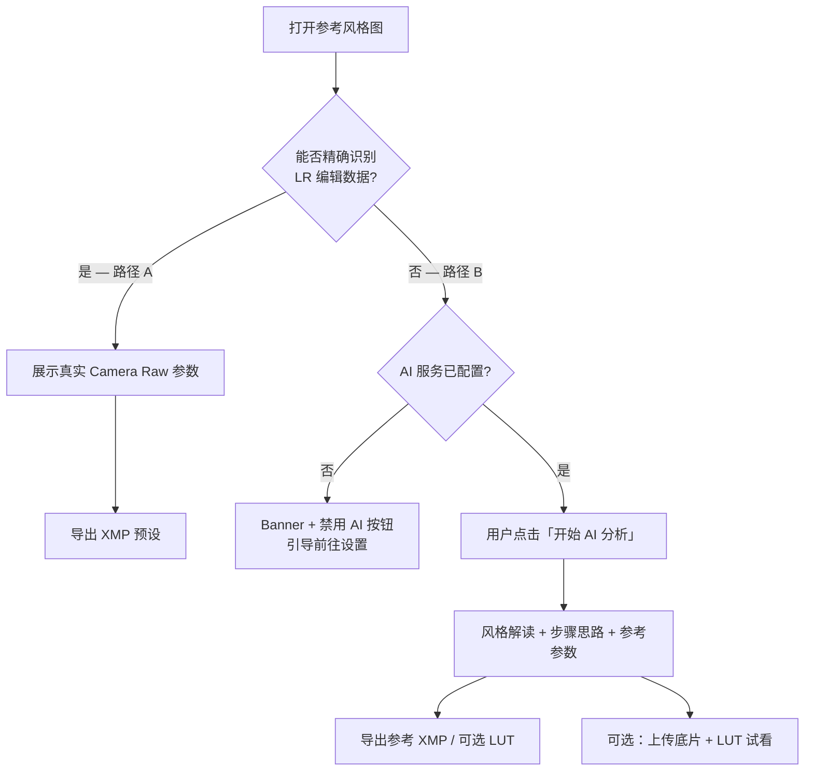

# Lightroom 预设学习器

[English](README.md) · **简体中文**

面向摄影爱好者的桌面工具：从成片**反推 Lightroom 调色方法**——能读到真实编辑数据时精确提取，读不到时用 AI 辅助学习风格与参考参数。

> **这不是**一键滤镜或面向大众的「自动变美」应用，而是帮助你在 Lightroom 里**对照学习**的助手。

---

## 目录

- [项目背景](#项目背景)
- [目标与原则](#目标与原则)
- [程序如何工作](#程序如何工作)
- [快速上手](#快速上手)
- [文档指南](#文档指南)
- [项目结构](#项目结构)
- [版本演进：v1 → v2](#版本演进v1--v2)
- [当前不足](#当前不足)
- [后续方向](#后续方向)
- [隐私与费用](#隐私与费用)
- [许可证](#许可证)

---

## 项目背景

从 **Lightroom 导出的 JPG/TIFF** 中，有时仍保留 **Camera Raw / Lightroom 编辑元数据（XMP）**，里面是 Develop 面板的**真实滑块值**，是学习调色的可靠依据。

但很多网络传播的图片（二次压缩、截屏、平台重编码）**已不含**这些数据。若仍用全局像素统计去「猜」参数，结果往往与 LR 实际设置相差很大。

本项目最初是 **PyQt6 + OpenCV** 原型：用 10 个规则分析器从图像统计推测 LR 参数。**v2** 将产品重新定位为两条清晰路径：**精确识别**（有编辑数据）与 **AI 辅助学习**（无编辑数据），并在界面文案中避免向用户暴露 metadata 等专业术语。

---

## 目标与原则

| 目标 | 说明 |
|------|------|
| **以学为主** | 展示「怎么调的」——分组参数、AI 思路；用户确认后才导出 |
| **能精确则精确** | 路径 A 读取真实 XMP/CRS 字段，**无需 API** |
| **不能精确则诚实** | 路径 B 明确标注「AI 参考分析」，非 ground truth |
| **界面克制** | 比 Lightroom 简单一个数量级；深色摄影工具风 |
| **默认安全** | 分析结果仅在内存展示；**点击导出才写盘**；本地 AI 配置不入库 |

---

## 程序如何工作



### 两条路径（用户向用语）

| | **路径 A — 精确识别** | **路径 B — AI 辅助学习** |
|---|----------------------|-------------------------|
| **触发** | 检测到 JPG/TIFF 内嵌或 sidecar `.xmp` 中的 LR 编辑数据 | 未能精确识别 |
| **结果** | 真实 CRS 参数 | AI 风格解读 + 参考参数 |
| **API** | 不需要 | OpenAI 兼容 Vision API（用户自备 Key） |
| **导出** | XMP（对话框内可选 LUT） | 参考 XMP / 可选 `.cube` LUT |
| **底片试看** | 隐藏 | AI 分析完成后可用（UI v1.6，仅左栏一处） |

> **路径 B 备注（AI 调用路径）：** 路径 B 指 **AI 调用链路**，不是独立程序。精确识别失败后，用户须点击「开始 AI 分析」；后台 Worker 加载 system prompt → 调用 OpenAI 兼容 Vision API → 按 `style_analysis.v1` 校验 JSON → 可选烘焙内存 LUT 供底片试看。详见 [路径 B — AI 调用链](#路径-b--ai-调用链开发者备注) 与 [`docs/AI_ARCHITECTURE.md`](docs/AI_ARCHITECTURE.md)。

### 路径 B — AI 调用链（开发者备注）

路径 B = 用户向文案 **「未能精确识别 → AI 辅助学习」**；代码中为 `AnalysisMode.AI_LEARNING`。

```
gui/main_window.run_ai_analysis()
  └─ gui/workers.AiAnalysisWorker
       ├─ config/ai_config.load_ai_config()
       ├─ ai/factory.create_analyzer()
       │    └─ ai/openai_compatible_provider.analyze()
       │         ├─ 读取 config/prompts/style_analysis.txt（或 .en.txt）
       │         ├─ HTTP Vision API（图片 + system prompt）
       │         ├─ ai/response_parser.parse_json_content()
       │         └─ ai/validator.normalize_style_analysis()
       ├─ ai/service.style_result_to_report()
       └─ ai/service.build_lut_for_report() → lut/lut_generator（可选 cube）
```

| 阶段 | 主要代码 | 对应文档 |
|------|----------|----------|
| 触发与线程 | `gui/main_window.py`, `gui/workers.py` | [`CODE_ARCHITECTURE.md`](docs/CODE_ARCHITECTURE.md) |
| API 与 Prompt | `ai/openai_compatible_provider.py`, `config/prompts/` | [`AI_ARCHITECTURE.md`](docs/AI_ARCHITECTURE.md) |
| JSON 契约 | `ai/validator.py`, `ai/parameter_registry.py`, `schemas/` | [`AI_RESPONSE_SCHEMA.md`](docs/AI_RESPONSE_SCHEMA.md) |
| Prompt 变更记录 | `config/prompts/*.txt` | [`PROMPT_CHANGELOG.md`](docs/PROMPT_CHANGELOG.md) |
| LUT 试看 | `lut/lut_generator.py`, `lut/lut_applier.py` | [`AI_ARCHITECTURE.md`](docs/AI_ARCHITECTURE.md) §6 |

**在 Cursor 中改路径 B：** `@docs/AI_ARCHITECTURE.md`（流程 + SOP）· `@docs/PROMPT_CHANGELOG.md`（若改 prompt）· `@docs/AI_RESPONSE_SCHEMA.md`（若改 JSON 字段）。

---

## 快速上手

### 环境要求

- **Python 3.10+**
- **Windows**（推荐，提供 `run.bat`）
- macOS / Linux 可按下方手动步骤运行

### Windows 一键启动

```bat
run.bat
```

脚本会自动创建 `venv`、安装依赖、运行 UI 版本检查并启动程序。

### 手动安装

```bash
python -m venv venv
# Windows: venv\Scripts\activate
pip install -r requirements.txt
python main.py
```

### 配置 AI（仅路径 B）

1. 复制示例配置：
   ```bat
   copy config\ai_config.example.yaml config\ai_config.local.yaml
   ```
2. 打开软件 → **设置 → AI 服务**
3. 填写 **API Key**、**模型名称**，可选 **Base URL**（兼容中转/本地网关）
4. 保存并 **测试连接**

> **`config/ai_config.local.yaml` 已在 `.gitignore` 中**，不会上传到 GitHub。  
> **路径 A 无需任何 API Key 即可完整使用。**

### 支持格式

JPG / JPEG / PNG / WebP — 拖拽或点击「打开图片」。

---

## 文档指南

本 README 是对外**总介绍**。日常改代码时，按任务打开对应文档 — 在 Cursor 里可直接 `@` 文件路径。

**完整分层说明（人读 / AI 读 / 机器读）：** [`docs/README.md`](docs/README.md)

### 当前文档清单与职责

| 文档 | 类型 | 负责内容 |
|------|------|----------|
| [`README.md`](README.md) | 入口 · 英文 | 对外概览、安装、双路径说明、**本文档索引** |
| [`README.zh-CN.md`](README.zh-CN.md) | 入口 · 中文 | 与英文版相同 |
| [`docs/README.md`](docs/README.md) | 总索引 | L0–L5 文档分层；人读 / AI 读 / 机器读划分 |
| [`docs/PRODUCT_SPEC_v2.md`](docs/PRODUCT_SPEC_v2.md) | 人读 · 产品 | 功能、路径 A/B 需求、验收、风险 — **程序该做什么** |
| [`docs/UI_UX_DESIGN.md`](docs/UI_UX_DESIGN.md) | 人读 · 界面 | 布局、状态机、组件、深色主题；**§11 文案库** — **界面长什么样、写什么字** |
| [`docs/CODE_ARCHITECTURE.md`](docs/CODE_ARCHITECTURE.md) | 人读 · 代码 | 模块图、路径 A/B 调用链、配置、导出 — **全项目代码怎么串** |
| [`docs/AI_ARCHITECTURE.md`](docs/AI_ARCHITECTURE.md) | 人读 · AI | 路径 B / **AI 调用路径**、Provider、prompt 加载、校验、**改 prompt 的 SOP** |
| [`docs/AI_RESPONSE_SCHEMA.md`](docs/AI_RESPONSE_SCHEMA.md) | 人读 · 契约 | JSON 字段、LUT/XMP 路由、错误行为、schema 版本 |
| [`docs/PROMPT_CHANGELOG.md`](docs/PROMPT_CHANGELOG.md) | 人读 · 审计 | **Prompt 变更历史** — 每次为什么改、影响什么 |
| [`AGENTS.md`](AGENTS.md) | AI · 入口 | 给编码 Agent 的短指引：关键路径、检查清单 |
| [`.cursor/rules/project-context.mdc`](.cursor/rules/project-context.mdc) | AI · 规则 | 始终生效：产品定位、文档指针、UI v1.6 底片布局 |
| [`.cursor/rules/ai-module.mdc`](.cursor/rules/ai-module.mdc) | AI · 规则 | 改 `ai/`、`prompts/`、`schemas/` 时必须同步的文件 |
| [`.cursor/rules/ui-copy.mdc`](.cursor/rules/ui-copy.mdc) | AI · 规则 | 改 `gui/` 时文案须遵循 UI §11 |
| [`schemas/style_analysis.v1.json`](schemas/style_analysis.v1.json) | 机器读 | 路径 B 模型输出的 JSON Schema（`style_analysis.v1`） |
| [`config/prompts/style_analysis.txt`](config/prompts/style_analysis.txt) | 机器读 + 可审 | 运行时 system prompt（中文），发往 Vision API |
| [`config/prompts/style_analysis.en.txt`](config/prompts/style_analysis.en.txt) | 机器读 + 可审 | 运行时 system prompt（英文） |
| [`gui/copy.py`](gui/copy.py) | 运行时 | 界面字符串；须与 [`UI_UX_DESIGN.md`](docs/UI_UX_DESIGN.md) §11 一致 |

### 想改什么 → `@` 哪份文档

| 目标 | 建议 `@` |
|------|----------|
| 产品行为、功能、验收标准 | `docs/PRODUCT_SPEC_v2.md` |
| 布局、按钮、状态、用户可见文案 | `docs/UI_UX_DESIGN.md`（并同步 `gui/copy.py`） |
| 主流程、模块、路径 A、导出 | `docs/CODE_ARCHITECTURE.md` |
| **路径 B / AI 接口 / prompt / JSON 校验** | `docs/AI_ARCHITECTURE.md` |
| 增删 AI 返回字段 | `docs/AI_RESPONSE_SCHEMA.md` + `schemas/` + `ai/parameter_registry.py` |
| 改 prompt 措辞或语气 | `config/prompts/` + **`docs/PROMPT_CHANGELOG.md`** |
| 让 Cursor 遵守仓库约定 | `AGENTS.md` |

### 校验脚本

| 脚本 | 何时运行 |
|------|----------|
| [`scripts/verify_ui.py`](scripts/verify_ui.py) | 改 GUI / 布局后 |
| [`scripts/verify_ai_schema.py`](scripts/verify_ai_schema.py) | 改 AI schema、registry 或 validator 后 |

**UI 版本：** 见窗口标题，如 `Lightroom 预设学习器 (UI 1.6.0)`。

---

## 项目结构

```
lightroom_preset_generator/
├── ai/                  # OpenAI 兼容 Vision 调用、schema、服务层
├── analyzers/           # v1 规则分析器（遗留，v2 主流程已不依赖）
├── config/              # 应用设置、AI 配置（example + local）
├── core/                # 元数据检测/解析、会话模型、流水线
├── docs/                # 产品规格 + UI/UX 设计
├── generators/          # XMP 预设生成
├── gui/                 # PyQt6 主窗口、组件、对话框、QSS 主题
├── lut/                 # 本地 LUT 烘焙与底片预览
├── preview/             # OpenCV 预设模拟（遗留辅助）
├── scripts/             # verify_ui.py — 启动前 UI 检查
├── main.py              # 入口
└── run.bat              # Windows 启动脚本
```

---

## 版本演进：v1 → v2

### 能力对比

| | **v1**（`673ef82` 初始提交） | **v2**（`179865a` 双路径重构） |
|---|-------------------------------|--------------------------------|
| **核心思路** | 10 个分析器从像素统计推测参数 | 优先精确识别 + 可选 AI |
| **准确性** | 启发式猜测 | 有 XMP 时为真实参数 |
| **AI** | 无 | OpenAI 兼容 Vision API |
| **导出** | XMP | XMP + 可选 `.cube` LUT |
| **界面** | 基础列表 + 预览 | StatusCard、学习面板、设置/导出对话框、深色 QSS |
| **底片试看** | 无 | 参考图下方单区域（v1.6，去重右栏） |
| **文档** | 无 | 产品规格 + UI 设计约 1700+ 行 |
| **代码量** | 28 文件，约 +1722 行 | 相对 v1 再 +4147 / −326 行 |

### Git 提交记录

```
673ef82  Initial commit: Lightroom preset generator
179865a  feat: v2 dual-path refactor with AI learning, metadata extraction, and UI v1.6
```

<details>
<summary>v2 相对 v1 主要变更文件</summary>

- **新增**：`ai/`、`core/metadata_detector.py`、`core/metadata_parser.py`、`lut/`、`gui/copy.py`、`gui/workers.py`、`gui/styles/`、`docs/`、`scripts/verify_ui.py`、`config/ai_config.*`
- **大改**：`gui/main_window.py`、`gui/widgets.py`
- **配置**：`.gitignore` 增加本地 AI 配置与测试图片规则

</details>

---

## 当前不足

### 产品与体验

- **LUT 试看仅为本地近似** — 由简化公式烘焙，非 Adobe 渲染引擎，与 LR 视觉效果会有差异；**学习请以 XMP 为准**。
- **AI 参数是参考值** — 路径 B 输出需用户在 LR 中验证、微调。
- **单张工作流** — 无批量导入、文件夹监听、与 LR 目录联动。
- **界面语言** — 当前为中文 UI；英文 locale 尚未实现（文案已 key 化，见 `gui/copy.py`）。
- **底片试看** — 仅路径 B、且需先完成 AI 分析；路径 A 有意隐藏底片区。

### 技术层面

- **元数据解析覆盖面** — 支持内嵌 XMP 与同目录 sidecar；非常规导出、字段残缺等需更多真实样本；ExifTool fallback 在规格中，尚未实现。
- **v1 分析器仍留仓库** — `analyzers/` 未删除，但 v2 主路径已不再以其为默认入口。
- **AI 返回格式** — 依赖模型遵循 JSON schema，极端情况下仍可能失败。
- **平台** — `run.bat` 面向 Windows；其他系统需手动配置 venv。
- **无自动化测试 / CI** — 质量依赖产品文档中的手工验收场景。

### 工程化

- **尚无 LICENSE** — 二次分发条款未定义。
- **规格文档状态** — `PRODUCT_SPEC_v2.md` 部分条目仍标「待开发」，与已实现的 UI v1.6 存在时间差；以仓库代码与本 README 为准。

---

## 后续方向

与 [`docs/PRODUCT_SPEC_v2.md`](docs/PRODUCT_SPEC_v2.md) 优先级一致：

### 近期（P1）

- [ ] 扩大 metadata 样本测试 + ExifTool 降级方案
- [ ] 导出 / AI 错误处理加固
- [ ] 浅色主题或外观切换
- [ ] README 配图与短演示

### 中期（P2）

- [ ] 文件夹批量分析
- [ ] 更多 API 类型（非 OpenAI 兼容协议）
- [ ] metadata 解析与 XMP 生成的自动化测试
- [ ] CI（Windows 冒烟测试）

### 更长远的设想

- [ ] 与 Lightroom Classic 的插件或 sidecar 工作流
- [ ] AI「建议优先调整」参数的置信度校准
- [ ] 英文界面 locale

---

## 隐私与费用

| 路径 | 网络 | 费用 |
|------|------|------|
| **A — 精确识别** | 完全本地 | 免费 |
| **B — AI 分析** | 图片上传至**您配置的 API 地址** | 按服务商计费（OpenAI、智谱等） |

API Key 仅保存在本地设置或 `config/ai_config.local.yaml`。分析客户作品前请阅读服务商隐私政策。

**Cursor 等 IDE 订阅不能替代本软件路径 B 所需的 API Key。**

---

## 许可证

仓库尚未添加 LICENSE 文件。在明确许可证之前，版权归仓库所有者所有；如需二次分发请联系维护者。

---

## 常见问题

| 现象 | 建议 |
|------|------|
| 更新后界面仍是旧的 | 删除 `gui/__pycache__`，用 `run.bat` 重启 |
| 一直显示「AI 未配置」 | 路径 B 预期行为；路径 A 不受影响 |
| `verify_ui.py` 失败 | 检查 `config/settings.py` 中 `ui_version` 与 widgets 文档注释 |
| 担心 Key 泄露 | 勿提交 `ai_config.local.yaml`；仓库仅含空的 example 文件 |

---

<p align="center">
  <sub>Lightroom 为 Adobe Inc. 商标。本项目与 Adobe 无关联。</sub>
</p>
