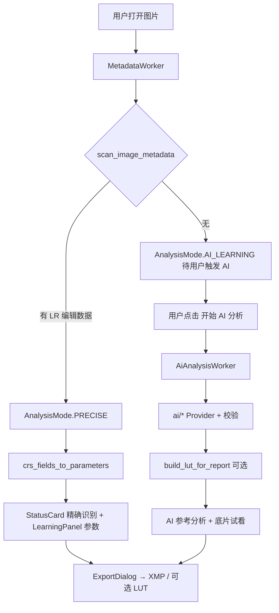

# 代码架构说明

> **读者：** 维护者、Code Review、需要改主流程的开发者。  
> **不是：** 产品需求全文（见 [`PRODUCT_SPEC_v2.md`](./PRODUCT_SPEC_v2.md)）或界面规格（见 [`UI_UX_DESIGN.md`](./UI_UX_DESIGN.md)）。  
> **AI 路径细节：** 见 [`AI_ARCHITECTURE.md`](./AI_ARCHITECTURE.md)。

---

## 1. 程序入口

```
main.py
  └─ gui/main_window.py :: run_app()
       ├─ 加载 gui/styles/app_dark.qss
       ├─ MainWindow（工具栏、ImageZone、StatusCard、LearningPanel）
       └─ _sync_ui() 统一刷新 L1/L2/L3 提醒与按钮状态
```

| 文件 | 职责 |
|------|------|
| `main.py` | `sys.path`、启动日志、调用 `run_app()` |
| `gui/main_window.py` | 会话状态、加载图片、触发 Worker、导出、设置 |
| `gui/widgets.py` | `ImageZone`（参考图/试看纵向分割 + 试看区滚动）、`StatusCard`、`LearningPanel`、Banner 等 |
| `gui/workers.py` | `MetadataWorker`、`AiAnalysisWorker`（QThread） |
| `gui/copy.py` | 界面文案（对齐 UI 文档 §11） |

---

## 2. 双路径总览



| 路径 | 模式枚举 | 触发 | 参数来源 |
|------|----------|------|----------|
| **A** | `AnalysisMode.PRECISE` | 打开图片后自动 | `core/metadata_parser.py` |
| **B** | `AnalysisMode.AI_LEARNING` | 用户确认 + API 已配置 | `ai/*` → `AiLearningReport` |

---

## 3. 路径 A — 精确识别

| 步骤 | 模块 | 说明 |
|------|------|------|
| 检测 | `core/metadata_detector.py` | 内嵌 XMP → 同目录 `.xmp` sidecar |
| 解析 | `core/metadata_parser.py` | CRS 字段 → `ParameterResult` 列表 |
| 分组 | `group_parameters()` | 按 LR 面板分组供 LearningPanel |
| 展示 | `gui/main_window._sync_ui()` | 绿色 StatusCard；隐藏底片试看区 |
| 导出 | `gui/export_dialog.py` + `generators/xmp_generator.py` | 用户选路径；LUT 为可选项 |

**不调用：** `ai/`、`analyzers/` 主路径。

---

## 4. 路径 B — AI 辅助学习

详见 [`AI_ARCHITECTURE.md`](./AI_ARCHITECTURE.md)。摘要：

```
AiAnalysisWorker
  → ai/factory.create_analyzer()
  → OpenAiCompatibleProvider.analyze()
  → ai/service.style_result_to_report()
  → lut/lut_generator.build_lut_from_params()（内存 cube）
  → ImageSession.lut_cube 供底片试看
```

---

## 5. 模块目录

| 目录 | 职责 | 主路径 |
|------|------|--------|
| `core/` | 会话模型、metadata 检测/解析 | A + 分流 |
| `ai/` | Provider、JSON 解析、校验、转报告 | B |
| `lut/` | 3D LUT 烘焙与应用 | B 预览；A/B 导出可选 |
| `generators/` | XMP 写入 | A 精确；B 参考 |
| `gui/` | PyQt6 界面与后台线程 | 全部 |
| `config/` | `settings.py`（分析器开关）、`ai_config.py`、`provider_presets.py` | 全部 |
| `preview/` | v1 OpenCV 模拟器 | **遗留**，非 v2 主路径 |
| `analyzers/` | v1 规则推测（10 模块） | **遗留**，默认不走 |

---

## 6. 核心数据模型

定义于 `core/inference_result.py`：

| 类型 | 用途 |
|------|------|
| `ImageSession` | 当前图片会话：模式、参数、AI 报告、LUT cube、耗时 |
| `ParameterResult` | 单条参数：key、value、confidence、标签、是否参与 LUT/XMP |
| `AiLearningReport` | Path B：印象、步骤、优先调整、参数列表 |
| `AnalysisMode` | `PRECISE` / `AI_LEARNING` |

---

## 7. 配置与密钥

| 文件 | 入库 | 用途 |
|------|------|------|
| `config/settings.py` | 是 | UI 版本、遗留分析器开关 |
| `config/ai_config.example.yaml` | 是 | 示例模板（空 Key）；含 `provider_preset` |
| `config/ai_config.local.yaml` | **否**（gitignore） | 用户 API Key、模型、预设、prompt 路径 |
| 环境变量 `OPENAI_API_KEY` | — | 可选，与 local yaml 二选一 |

就绪判断：`AiConfig.is_ready()` → Key + model 非空。

---

## 8. 导出与预览

| 功能 | 入口 | 说明 |
|------|------|------|
| XMP 导出 | `ExportDialog` → `xmp_generator` | 路径 A 精确；路径 B 带「AI 参考」语义 |
| LUT 导出 | 勾选后 `lut_generator` 写 `.cube` | 本地近似，非 Adobe 引擎 |
| 底片 LUT 试看 | `ImageZone` + `lut/lut_applier.py` | 仅路径 B；纵向分割 + 试看区滚动（UI §3.4.5）；需先有 `session.lut_cube` |

---

## 9. 启动与校验

| 脚本 | 时机 |
|------|------|
| `run.bat` | Windows：venv、依赖、`scripts/verify_ui.py`、`main.py` |
| `scripts/verify_ui.py` | 检查 UI 版本、PlateControlCard 已移除等 |
| `scripts/verify_ai_schema.py` | 检查 schema 与 `parameter_registry` 一致（AI 改动后建议跑） |

---

## 10. 遗留代码说明

v1 的 `analyzers/` + `core/pipeline.py` 规则推测链路仍保留在仓库中，**v2 主窗口不以其为默认入口**。  
若将来做「AI 失败 fallback」，须在 UI 明确标注且更新 PRODUCT_SPEC。

---

## 11. 修订记录

| 日期 | 说明 |
|------|------|
| 2026-06-30 | 初版：从 PRODUCT_SPEC §5–§6 抽离实现向架构 |
