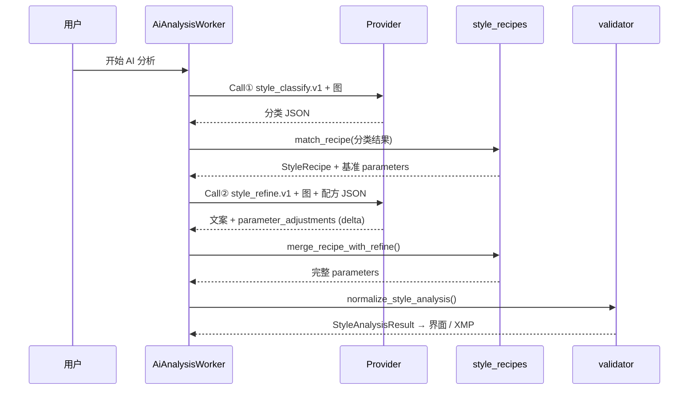

# 风格配方库 + 双次 AI 调用方案（路线 B）

> **状态：** 配方库与匹配逻辑已落地（`config/style_recipes/`、`ai/style_recipes.py`）；  
> **双次 AI 管线** 见下文设计，默认仍走单次 `style_analysis.v1.1`，通过 `analysis.use_recipe_pipeline` 开关启用（待接线）。

---

## 1. 要解决什么问题

| 现状（单次 AI） | 问题 |
|----------------|------|
| Vision 一次输出 11+ 参数 | 数字飘、子类判错则全表错 |
| §3 区间写在超长 prompt 里 | 难维护、难回归、模型记不住 |
| 强制 11 项非零 | XMP 带无意义敷衍值 |

**路线 B 原则：**

- **配方库** 提供可信的 **参数起点**（来自 taxonomy + 产品整理的典型 look）
- **第 1 次 AI** 只做 **分类与风格标签**（轻、稳）
- **第 2 次 AI** 在配方基础上只做 **文案 + 小范围微调（delta）**
- **本地 merge + validator** 生成最终 XMP，不盲信模型绝对值

---

## 2. 总体架构



---

## 3. 双次 AI 调用 — 详细方案

### Call ① 风格分类（`style_classify.v1`）

**目的：** 只看「是什么场景 / 什么风格」，**不输出 LR 滑块数值**。

| 项 | 说明 |
|----|------|
| Prompt | [`config/prompts/style_classify.txt`](../config/prompts/style_classify.txt) |
| Schema | [`schemas/style_classify.v1.json`](../schemas/style_classify.v1.json) |
| 输出字段 | `category`, `subtype`, `light`, `pre_graded`, `scene_keywords`, `style_hints`, `subtype_confidence`, `candidate_recipe_ids`（可选，模型建议） |
| Token | 约为完整 `style_analysis` 的 **25%～35%** |
| 重试 | 同现有 `max_retries`；失败可降级为 `generic-daylight-landscape` |

**本地步骤（不调 API）：**

```python
recipe = match_recipe(classify_result)  # ai/style_recipes.py
```

匹配规则见 [`config/style_recipes/README.md`](../config/style_recipes/README.md)。

---

### Call ② 配方微调（`style_refine.v1`）

**目的：** 结合 **已选配方基准** 与 **当前画面**，输出学习文案 + **受限 delta**。

| 项 | 说明 |
|----|------|
| Prompt | [`config/prompts/style_analysis_refine.txt`](../config/prompts/style_analysis_refine.txt) |
| Schema | 见下文 §3.3（可后续固化为 `schemas/style_refine.v1.json`） |
| 输入（user message） | ① 配方 `id`、名称、基准 `parameters`、`tweak_limits`；② Call① 的分类摘要；③ 图片 |
| **禁止** | 输出完整 11 项绝对值（除非 `override` 且在 `tweak_limits` 内且带 reason） |

**推荐输出形状：**

```json
{
  "overall_impression": "【风光/L-自然通用/日光】…",
  "editing_steps": [
    { "title": "场景识别", "description": "…" },
    { "title": "白平衡与影调", "description": "…" }
  ],
  "priority_adjustments": ["Contrast2012", "Saturation", "Temperature"],
  "parameter_adjustments": {
    "Exposure2012": { "delta": 0.06, "confidence": 0.70, "reason": "整体略欠曝" },
    "Saturation": { "delta": -4, "confidence": 0.66, "reason": "草地已够艳" }
  },
  "optional_7b": {
    "SplitToningShadowHue": { "value": 200, "confidence": 0.55 }
  }
}
```

**合并规则（`merge_recipe_with_refine`）：**

1. 以配方 `parameters` 为 base  
2. 对每个 `parameter_adjustments[key].delta`：`value = base + delta`，再 clamp 到 `tweak_limits` 与 `PARAMETER_SPECS`  
3. `confidence = min(recipe_confidence, adjust.confidence)`，配方项默认 `recipe.default_confidence`（通常 0.70）  
4. `optional_7b`：仅当 refine 给出且配方 `optional_7b` 允许或 refine 新增白名单项时合并  
5. `pre_graded=true`（Call①）→ 所有 delta 乘以 `0.4`，confidence 上限 0.50  

---

### 与单次调用的关系

| 模式 | 配置 | 行为 |
|------|------|------|
| **legacy**（默认） | `use_recipe_pipeline: false` | 现有 `style_analysis.txt` 单次调用 |
| **recipe** | `use_recipe_pipeline: true` | Call① + 匹配 + Call② + merge |

**灰度上线：** 设置页或 `ai_config.local.yaml` 开关；日志记录 `matched_recipe_id` 供对比。

---

## 4. 配方库文件

目录：[`config/style_recipes/`](../config/style_recipes/)

| 文件 | 场景 |
|------|------|
| `generic-daylight-landscape.yaml` | 兜底：L 自然日光 |
| `film-lowsat-meadow.yaml` | 胶片感低饱和草原/牧场 |
| `cinematic-teal-orange.yaml` | 青橙电影感风光 |
| `soft-portrait-natural.yaml` | 室外自然光人像 |
| `golden-hour-portrait.yaml` | 黄金时刻人像 |
| `blue-hour-landscape.yaml` | 蓝调时刻风光 |
| `neon-night-city.yaml` | 城市夜景霓虹 |

维护说明：[`config/style_recipes/README.md`](../config/style_recipes/README.md)

---

## 5. 代码落点（接线清单）

| 阶段 | 文件 | 工作 |
|------|------|------|
| 已有 | `ai/style_recipes.py` | 加载、匹配、merge |
| 已有 | `config/style_recipes/*.yaml` | 配方数据 |
| 待做 | `ai/openai_compatible_provider.py` | `analyze_recipe_pipeline()` 双次调用 |
| 待做 | `ai/style_classify.py` | 解析 / 校验 Call① |
| 待做 | `ai/style_refine.py` | 解析 / 校验 Call② |
| 待做 | `config/ai_config.py` | `use_recipe_pipeline` |
| 待做 | `gui/settings_dialog.py` | 可选开关 |
| 待做 | `scripts/verify_style_recipes.py` | 配方 YAML 校验 |

**Call② 之后** 仍走现有 `normalize_style_analysis()`，保证 XMP / LUT / 学习面板不变。

---

## 6. 成本与延迟

| 指标 | 单次 | 双次 |
|------|------|------|
| API 调用 | 1 | 2 |
| 延迟 | T | 约 1.6T～1.9T（Call① 更短） |
| 费用 | 1× | 约 1.3×～1.6×（Call① token 少） |
| XMP 稳定性 | 中 | **高**（数字锚定在配方） |

**优化：** Call① 可用更小/更快 vision 模型（配置项 `classify_model`，默认同主模型）。

---

## 7. 验收标准

1. **匹配：** 10 张标注图，recipe id 与人工预期一致 ≥ 7/10  
2. **参数：** 相对单次 AI，与人工 LR 参考值的 MAE 下降（内部样张集）  
3. **文案：** `editing_steps` 仍结合画面细节，非纯模板复读  
4. **边界：** `pre_graded`、子类不确定时 confidence / delta 缩放生效  
5. **回归：** `scripts/verify_style_recipes.py` + `verify_ai_schema.py` 通过  

---

## 8. 相关文档

- [`AI_ARCHITECTURE.md`](./AI_ARCHITECTURE.md) — Path B 总览  
- [`AI_RESPONSE_SCHEMA.md`](./AI_RESPONSE_SCHEMA.md) — §7a / §7b  
- [`PROMPT_CHANGELOG.md`](./PROMPT_CHANGELOG.md) — 启用双次时须记条目  
