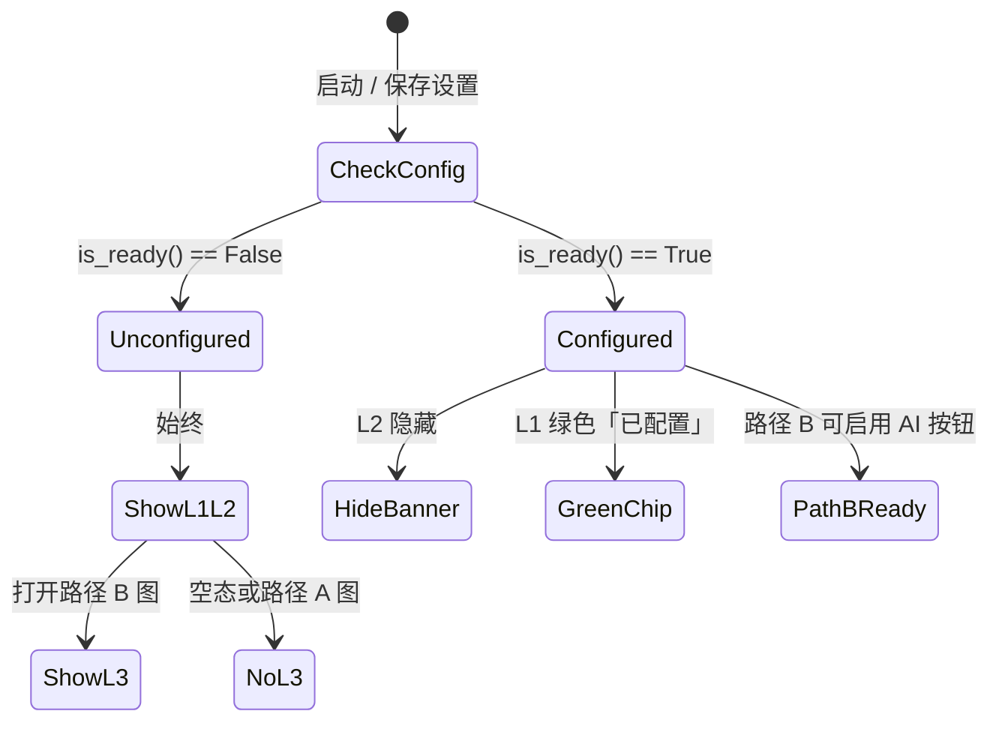

# Lightroom 预设学习器 — UI / UX 设计说明

> 文档版本：v1.6.2  
> 关联文档：[PRODUCT_SPEC_v2.md](./PRODUCT_SPEC_v2.md)（功能与实现规格）  
> 适用框架：PyQt6  
> 目标用户：想学习调色的摄影爱好者  

**用途：** 后续修改 `gui/` 代码时，以本文档为界面与交互的单一参考源。

**文档分层：** 全项目索引见 [`docs/README.md`](./README.md)（人读 / AI 读 / 机器读）；代码与 AI 实现见 [`CODE_ARCHITECTURE.md`](./CODE_ARCHITECTURE.md)、[`AI_ARCHITECTURE.md`](./AI_ARCHITECTURE.md)。

**改界面布局 / 组件：** 读 §2–§7。  
**改用户可见文案（按钮、提示、状态、对话框）：** 统一在 **§11 文案库** 修改；产品规格文档不重复维护字句。

---

## 1. 设计目标与原则

### 1.1 设计目标

| 目标 | 说明 |
|------|------|
| **易学** | 右侧优先展示「怎么调的」，而非 Debug 数据 |
| **可信** | 精确提取 vs AI 推测，视觉与文案双重区分 |
| **克制** | 比 Lightroom 简单一个数量级；单一主工具栏 |
| **专业感** | 深色摄影工具风，大图 + 信息面板 |

### 1.2 UX 原则

1. **自动分流** — 打开图片后自动尝试精确识别 Lightroom 编辑数据，用户不选手动模式  
2. **一动作一入口** — 同屏不出现两个相同功能按钮（设置、AI、导出）  
3. **先学后导** — 分析结果展示 → 用户确认 → 导出（不自动写盘）  
4. **可选加深** — 底片 LUT 预览仅在**左栏参考图下方**（单一区域，无右栏重复）  
5. **失败可理解** — 未配置 API、分析失败、未能精确识别均有明确下一步  

### 1.3 视觉原则

- 默认 **深色主题**（摄影类工具惯例）  
- 图像区 **最大视觉权重**（左侧约 58–62% 宽，占满内容区高度）  
- 状态用 **左侧色条 + 短文案**，不用弹窗轰炸  
- 不用 emoji 作主按钮图标（L2 可用 SVG 图标）  

---

## 2. 信息架构（IA）

```
Lightroom 预设学习器
├── 主窗口
│   ├── 菜单栏（文件 / 设置 / 帮助）
│   ├── 主工具栏（打开 / AI 分析 / 导出）
│   ├── AiConfigBanner（未配置 AI 时）
│   ├── 内容区（左右分栏 — 定稿 v1.3）
│   │   ├── 左：图像区（参考图在上 + 底片预览在下，见 §3.4）
│   │   └── 右：StatusCard + LearningPanel（**无底片试看重复区**）
│   └── 状态栏
├── 模态：导出对话框
├── 模态：AI 服务设置
└── 模态：关于
```

**不在主窗口底部常驻：** 全宽底片预览条（v1.2 已弃用，见 §3.4.3）。  
**不在主窗口常驻：** 预设名称输入、Debug 统计、第二套操作按钮。

---

## 3. 布局规格

### 3.1 主窗口网格

| 区域 | 比例 / 尺寸 | 说明 |
|------|-------------|------|
| 最小窗口 | 1100 × 720 px | 与 `settings.py` 一致 |
| 左右分栏 | 约 **58% : 42%** | `QSplitter`，可拖拽；**左侧专用于看图** |
| 左侧图像区最小高度 | ≥ **520** px（720 窗口下） | 占满 Banner 下、状态栏上全部高度 |
| 试看激活时左右比 | **62% : 38%** | 展开底片试看时左栏加宽（代码 `_split_plate`） |
| 主工具栏高度 | 40–44 px | 单行，不 wrap |
| StatusCard | 固定 72–96 px 高 | 不随内容无限增高 |
| LearningPanel | 占据右侧中部剩余高度 | 内容过长时内部滚动 |
| 底片试看 | **无**右栏组件；仅在左栏 `ImageZone` 底片预览区 | 见 §3.4 |

> **v1.6 变更：** 删除右栏 `PlateControlCard`（与左栏重复）；底片试看**仅左栏一处**；**启动即显示**底片预览区骨架，LUT 未就绪时按钮禁用。

### 3.2 主窗口线框（定稿 v1.3）

```
┌──────────────────────────────────────────────────────────────┐
│ 文件(F)  设置(S)  帮助(H)                                       │
├──────────────────────────────────────────────────────────────┤
│  [ 打开图片 ]   [ 开始 AI 分析 ]   [ 导出… ]                    │
├──────────────────────────────────────────────────────────────┤
│ ⚠  AI 服务未配置 …                              [ 前往设置 ]     │  ← 未配置时
├───────────────────────────────┬──────────────────────────────┤
│                               │ ┌ StatusCard ──────────────┐ │
│                               │ └──────────────────────────┘ │
│      左：图像区                  │ ┌ LearningPanel ───────────┐ │
│   ┌ 参考风格图（始终可见）─┐     │ │  参数 · 思路 · 教程        │ │
│   │  当前图片 / 参考图      │     │ └──────────────────────────┘ │
│   └──────────────────────┘     │ ┌ 底片试看控制卡 ──────────┐ │
│   ┌ 底片预览区（试看展开时）─┐   │ │ [上传底片] [应用 LUT 预览]  │ │
│   │ 待选 / 底片|效果 双格对比 │   │ └──────────────────────────┘ │
│   └──────────────────────┘     │                              │
├───────────────────────────────┴──────────────────────────────┤
│  …  ·  ● AI 未配置  ·  …                                       │
└──────────────────────────────────────────────────────────────┘
```

**AiConfigBanner：** 仅当 `AiConfig.is_ready() == False` 时显示；配置完成后**整行隐藏**。不可手动关闭。

**已配置时：** 无 Banner；状态栏显示 `● AI 已配置`（绿色圆点）。

### 3.3 间距与圆角（Design Tokens — L1）

| Token | 值 | 用途 |
|-------|-----|------|
| `space-xs` | 4 px | 控件内边距 |
| `space-sm` | 8 px | 卡片内元素间距 |
| `space-md` | 12 px | 卡片 padding |
| `space-lg` | 16 px | 分栏、工具栏 margin |
| `radius-sm` | 4 px | 按钮、输入框 |
| `radius-md` | 6 px | 预览区、卡片 |
| `border-width` | 1 px | 分割线、预览边框 |

### 3.4 底片试看布局（定稿 v1.6）

**v1.6 定稿（去重）：** 底片试看**只在左栏** `ImageZone` 内完成；**删除**右栏 `PlateControlCard`。左栏结构：**参考图（上）+ 底片预览区（下）**，启动后底片区**始终可见**（路径 A 除外）。

#### 3.4.1 左侧图像区 — 上下分区（唯一入口）

| 区域 | 显示条件 | 内容 |
|------|----------|------|
| **参考图区（上）** | 始终 | 空态占位或当前参考风格图 |
| **底片预览区（下）** | 空态 / 路径 B 各阶段 | **始终显示**；顶栏 `[ 上传底片 ]` + `[ 应用 LUT 预览 ]` + 状态行 + 预览框 |
| **路径 A** | 精确提取时 | **隐藏**整个底片预览区 |

**按钮启用规则：**

| 条件 | 上传底片 | 应用 LUT 预览 |
|------|----------|---------------|
| 空态 / 未打开图 | 禁用 | 禁用 |
| 路径 B · 未 AI / 无 LUT | 禁用 | 禁用 |
| 路径 B · AI 完成（有 LUT） | **启用** | 禁用（尚未选底片） |
| 已选底片 + 有 LUT | 启用（文案「更换底片」） | **启用** |

**空态 / 等待 AI 线框：**

```
┌─ 左栏 ─────────────────────────────────────────────┐
│ 参考风格图                                          │
│ ┌──────────────────────────────────────────────┐  │
│ │  拖入图片，或点击「打开图片」                    │  │
│ └──────────────────────────────────────────────┘  │
│ 在自己的底片上试看                                    │
│ [ 上传底片 ]  [ 应用 LUT 预览 ]   ← 均禁用          │
│ 打开参考风格图并完成 AI 分析后，可上传底片试看 LUT     │
│ ┌──────────────────────────────────────────────┐  │
│ │  点击「上传底片」或将图片拖入此区域  （占位）     │  │
│ └──────────────────────────────────────────────┘  │
└──────────────────────────────────────────────────┘
```

**路径 B · 已打开图、未完成 AI：**

```
│ [ 上传底片 ]  [ 应用 LUT 预览 ]   ← 均禁用          │
│ 请先完成 AI 分析，再上传底片并试看 LUT 效果           │
```

#### 3.4.5 滚动与纵向分割（v1.6.2）

左栏 `ImageZone` 在参考图与底片试看之间使用 **纵向 `QSplitter`**（`imageZoneSplit`），用户可拖动分配上下高度。

底片试看整块包在 **`QScrollArea`**（`platePreviewScroll`）内：当工具栏 + 对比预览 + 脚注总高度超过可视区域时，出现**纵向滚动条**，避免试看被裁成窄条。

| 项 | 规格 |
|----|------|
| 分割条 | 参考图区（上）与试看滚动区（下）；`setChildrenCollapsible(false)` |
| 默认比例 | 上约 3 : 下约 2（可拖） |
| 对比格最小高度 | 各 **140 px**（`LabeledPreview` 须尊重传入 `min_height`） |
| 路径 A | 隐藏整个试看滚动区（与 v1.6 一致） |

#### 3.4.6 可见性矩阵（v1.6 验收）

| 屏幕态 | 左栏底片预览区 | 上传底片 | 应用 LUT | 右栏 |
|--------|----------------|----------|----------|------|
| 空态 | **显示**（禁用） | 禁用 | 禁用 | 仅 StatusCard + LearningPanel |
| 路径 A | **隐藏** | — | — | 同上 |
| 路径 B · 待 AI | **显示**（禁用） | 禁用 | 禁用 | 同上 |
| 路径 B · AI 完成 | **显示** | 启用 | 有底片后启用 | 同上 |

#### 3.4.7 已废弃组件

| 组件 | v1.6 处理 |
|------|-----------|
| 右栏 `PlateControlCard` | **删除**，不得与左栏重复按钮 |
| 右栏折叠控制左栏显隐 | **删除**；底片区不再依赖右栏 checkbox |

#### 3.4.8 历史（v1.4–v1.5 差距，仅供追溯）

v1.5 曾保留右栏镜像按钮导致**双份「在自己的底片上试看」**；v1.6 合并为左栏单一区域。

| 项 | 规格 |
|----|------|
| 参考图区最小高度 | ≥ **280 px** |
| 底片待选区最小尺寸 | **360 × 280 px** |
| 对比格最小尺寸 | 各 **240 × 280 px** |
| 唯一按钮入口 | **仅**左栏底片预览区顶栏 |
| 拖放 | 有 LUT 时，待选区 / 对比左格可接收底片 |
| 路径 A | 隐藏底片预览区 |

---

## 4. 色彩系统（深色主题 L1）

| Token | 色值 | 用途 |
|-------|------|------|
| `bg-app` | `#1a1a1a` | 窗口背景 |
| `bg-panel` | `#242424` | 右侧面板、工具栏 |
| `bg-card` | `#2d2d2d` | StatusCard、GroupBox |
| `bg-preview` | `#141414` | 图像预览底 |
| `border-default` | `#3a3a3a` | 边框、分割线 |
| `text-primary` | `#e8e8e8` | 正文 |
| `text-secondary` | `#9a9a9a` | 说明、占位 |
| `text-disabled` | `#5a5a5a` | 禁用按钮 |
| `accent-precise` | `#43a047` | 精确提取色条 |
| `accent-ai-pending` | `#fb8c00` | 待 AI / 未能精确识别 |
| `accent-ai-done` | `#8e24aa` | AI 分析完成 |
| `accent-primary` | `#5c7cfa` | 主按钮（导出） |
| `accent-danger` | `#e53935` | 错误、**AI 未配置（路径 B 强提醒）** |
| `accent-ai-unconfigured` | `#ef5350` | AI 未配置状态栏圆点、Banner 图标 |
| `accent-ai-configured` | `#66bb6a` | AI 已配置（状态栏） |
| `bg-alert` | `#3d2020` | AI 未配置 Banner / 内联 Alert 背景 |
| `border-alert` | `#ef5350` | Alert 边框（可选） |

**StatusCard 左侧色条：** 宽 4 px，颜色随状态切换（上表 accent-*）。

---

## 5. Typography

| 用途 | 字体 | 字号 | 字重 |
|------|------|------|------|
| 状态标题 | 系统 UI | 14 px | 600 |
| 正文 / 参数 | 系统 UI | 13 px | 400 |
| 分组标题 | 系统 UI | 13 px | 600 |
| 说明 / 脚注 | 系统 UI | 12 px | 400 |
| 参数数值（可选） | Consolas / Cascadia Mono | 12 px | 400 |
| 状态栏 | 系统 UI | 11 px | 400 |

行高：正文约 1.5；LearningPanel 参数行最小高度 24 px。

---

## 6. 组件规范

### 6.1 主工具栏按钮

| 按钮 | 类型 | 默认 | 启用条件 |
|------|------|------|----------|
| 打开图片 | Secondary | 启用 | 始终 |
| 开始 AI 分析 | Secondary | 禁用 | **未能精确识别** **且** API 已配置 **且** 尚未分析或允许重分析 |
| 导出… | **Primary** | 禁用 | 路径 A 检测完成 **或** 路径 B AI 分析完成 |

**样式：** Primary 填充 `accent-primary`；Secondary 描边；Disabled  opacity 降低。

**去重：** 右侧面板 **不得** 再放置同名按钮。

### 6.2 StatusCard

文案以 **§11.3.4** 为准；下表仅作速查。

| 状态 | 色条 | key |
|------|------|-----|
| 精确提取 | 绿 | `status.precise` |
| 未能精确识别 + API 未配 | 红 | `status.no_meta_unconfigured` |
| 未能精确识别 + API 已配 | 橙 | `status.no_meta_ready` |
| AI 分析中 | 橙 | `status.ai_analyzing` |
| AI 完成 | 紫 | `status.ai_done` |

### 6.3 LearningPanel

**占位与段落正文以 §11.3.6 为准**；下列为**内容结构**示例（非最终措辞）。

**路径 A — 结构：**

```
【精确提取 — Camera Raw 参数】

■ 基础
  · 曝光 (Exposure2012): 0.35  (精确)
  · 对比度 (Contrast2012): 12  (精确)
  …

■ 颜色
  …
```

**路径 B — 结构：**

```
【整体印象】
{overall_impression}

【修改思路】
1. {title} — {description}
2. …

【建议优先调整】
Temperature · Shadows2012 · Saturation

【参考参数 · AI 推测】
■ 基础
  · 色温 (Temperature): 6000  (推测 70%)
  …
```

**空态占位：** 使用 §11 `learn.welcome_ready` / `learn.welcome_unconfigured`（不再在 §6.3 重复全文）。

**路径 B 待分析占位：** §11 `learn.path_b_ready` / `learn.path_b_unconfigured`。

**路径 B + API 未配置 — LearningPanel 顶部 InlineAlert：**

布局与样式见 **§6.8**；标题/正文 key 见 **§11.3.5**（`ai.inline_*`）。

### 6.4 图像预览区（ImagePreviewLabel）

| 状态 | 显示 |
|------|------|
| 空态 | §11 `image.empty` |
| 已加载 | 等比缩放，`KeepAspectRatio`；参考图区占左栏上部 |
| 底片预览 | 见 §3.4.1；参考图下方待选区或双格对比 |
| 加载失败 | 不进入此态（用 QMessageBox，§11 `error.*`） |

背景 `bg-preview`，边框 `border-default`，圆角 `radius-md`。对比模式下每格上方可选 11 px 次级标签（§11 `plate.label_*`）。

### 6.5 底片试看（仅左栏 ImageZone）

> **v1.6：** 完整规则见 **§3.4**；**无**右栏 `PlateControlCard`。

| 项 | 规格 |
|----|------|
| 唯一区域 | 左栏参考图下方的底片预览区 |
| 启动 / 空态 | 底片区**可见**，双按钮**禁用** |
| 路径 A | 隐藏底片预览区 |
| 路径 B + LUT | 启用「上传底片」；有底片后启用「应用 LUT 预览」 |

### 6.6 导出对话框

```
┌─ 导出 ──────────────────────────────────────┐
│  预设名称    [ ________________________ ]      │
│                                               │
│  ☑ 导出 XMP 预设                               │
│  保存路径    [ ________________ ]  [ 浏览… ]  │
│                                               │
│  ☐ 同时导出 LUT (.cube)    ← 默认不勾选        │
│  保存路径    [ ________________ ]  [ 浏览… ]  │  ← 勾选 LUT 后显示
│  ⓘ 由参数本地烘焙；学习调色请以 XMP 为准。       │
│                                               │
│                        [ 取消 ]  [ 导出 ]      │
└───────────────────────────────────────────────┘
```

| 路径 | XMP 默认 | LUT 默认 |
|------|----------|----------|
| A 精确 | ☑ | ☐ |
| B AI | ☑ | ☐ |

**路径规则：** 用户必须通过「浏览…」确认路径；可编辑默认建议路径。

### 6.7 设置对话框（AI 服务）

| 字段 | 控件 | 必填 |
|------|------|------|
| API Key | 密码框 | 启用 AI 时 |
| API Base URL | 单行文本 | 否（空=OpenAI 默认） |
| 模型名称 | 单行文本 | 启用 AI 时 |

**不包含：** 「服务商」下拉。

底部：隐私说明 + `[ 测试连接 ]` + `[ 取消 ]` `[ 保存 ]`（文案 key：`settings.*`，§11.3.8）

### 6.8 AI 未配置提醒（AiConfigReminder）— 定稿

**目标：** 用户在任何 relevant 时刻都能看见「AI 还没配」；路径 B 用**红色**强提醒，路径 A / 空态用**常驻但不过度干扰**的轻量提示。  
**可见文案 key：** §11.3.5（`ai.*`）。

#### 6.8.1 三层提醒结构

| 层级 | 组件 | 显示条件 | 强度 | 说明 |
|------|------|----------|------|------|
| L1 | **状态栏 AiStatusChip** | `is_ready()==False` 时始终显示 | 中 | 红色实心圆 `●` + §11 `ai.chip_unconfigured`；**可点击**打开设置 |
| L2 | **AiConfigBanner** | 同上 | 中–高 | 工具栏下方横条；⚠ + §11 `ai.banner` + `ai.banner_action` |
| L3 | **StatusCard + InlineAlert** | 仅 **路径 B**（未能精确识别）且未配置 | **高（红）** | StatusCard 左边条改红；LearningPanel 顶 InlineAlert |

**路径 A（精确提取）时：** 仅显示 L1 + L2；StatusCard **保持绿色**，LearningPanel **无** InlineAlert（此图不依赖 AI，避免误报恐慌）。

**空态（未打开图）时：** L1 + L2 + 右侧 LearningPanel 占位（§11.3.6 `learn.welcome_*`）。

**已配置后：** L1 变为 §11 `ai.chip_configured`（绿色）；L2/L3 **全部隐藏**。

#### 6.8.2 视觉规格

| 元素 | 规格 |
|------|------|
| 红色圆点 | `●` 或 8px 圆，`accent-ai-unconfigured` |
| Banner 高度 | 36–40 px，全宽，`bg-alert`，文字 `#ffcdd2` 或 `text-primary` |
| Banner 图标 | ⚠（Unicode）或 L2 SVG 警告图标；**不用 emoji 作按钮** |
| 「前往设置」 | 文本链接样式或 Ghost 小按钮；等价于菜单「设置 → AI 服务」 |
| StatusCard（路径 B 未配） | 左边条 4px，`accent-danger` / `#ef5350` |

#### 6.8.3 交互

| 操作 | 行为 |
|------|------|
| 点击状态栏「AI 未配置」 | 打开设置对话框 |
| 点击 Banner「前往设置」 | 打开设置对话框 |
| 点击 InlineAlert「前往设置」 | 打开设置对话框 |
| 设置保存且 `is_ready()` | 立即刷新 L1/L2/L3；路径 B 下启用「开始 AI 分析」 |
| 启动时 | 读取本地配置，**不弹模态**；仅展示 L1/L2 |

#### 6.8.4 与「开始 AI 分析」按钮

- 未配置：**禁用** + Tooltip §11 `ai.tooltip_disabled`  
- 已配置但未打开路径 B 图：**禁用**（路径 A）  
- 已配置 + 路径 B：**启用**

#### 6.8.5 实现映射

| 组件 | 建议位置 |
|------|----------|
| `AiConfigBanner` | `gui/widgets.py` → `main_window` central 布局顶栏下 |
| `AiStatusChip` | `QStatusBar` 永久 widget |
| InlineAlert | `LearningPanel` 顶部，条件渲染 |
| 刷新时机 | 启动、`load_image` 后、`SettingsDialog` 保存后 |

#### 6.8.6 设计决策（定稿理由）

| 问题 | 决策 | 理由 |
|------|------|------|
| 用什么形式提醒？ | **页面内常驻**（Banner + 状态栏红标），路径 B 加红色 StatusCard | 比启动弹窗更不打扰；比仅禁用按钮更易发现原因 |
| 为什么不用弹窗？ | 启动/打开图时**不弹**模态 | 用户可能先做路径 A；弹窗会被当作「必须立刻配 Key」的阻断 |
| 为什么分三层？ | L1 全局感知、L2 说明+行动、L3 路径 B 强提醒 | 一层不够显眼；三层全红会在路径 A 时造成误恐慌 |
| 路径 A 为何不用红 StatusCard？ | 精确识别**不依赖 AI** | 绿色 StatusCard 表示「当前图已就绪」；L1/L2 提示「将来未能精确识别的图需要 AI」 |
| Banner 能否关闭？ | **不可关闭** | 关闭后用户只剩状态栏小字，易忽略；配置完成后自动消失 |
| 红色符号用法 | 状态栏 `●`、Banner `⚠`、StatusCard 左边条、InlineAlert 边框 | 统一 `accent-ai-unconfigured` / `accent-danger`，形成「未就绪」视觉语言 |

#### 6.8.7 场景状态矩阵

| 场景 | L1 状态栏 | L2 Banner | L3 StatusCard | L3 InlineAlert | 「开始 AI 分析」 |
|------|-----------|-----------|---------------|----------------|------------------|
| 启动，未配 API，无图 | 红 `● AI 未配置` | 显示 | — | — | 禁用 |
| 打开路径 A 图，未配 API | 红 | 显示 | **绿**（精确提取） | 无 | 禁用 |
| 打开路径 B 图，未配 API | 红 | 显示 | **红** | **显示** | 禁用 |
| 打开路径 B 图，已配 API | 绿 `● AI 已配置` | 隐藏 | 橙（待分析） | 无 | 启用 |
| 任意，已配 API | 绿 | 隐藏 | 随业务态 | 无 | 按 §7.1 状态机 |

#### 6.8.8 场景线框

（线框与 §3.2 一致；场景 1–3 见 v1.2 修订记录，正文措辞以 §11 为准。）

#### 6.8.9 状态流转（提醒层）



---

## 7. 界面状态机（屏幕态）

```
                    ┌─────────┐
                    │  空态   │
                    └────┬────┘
                         │ 打开图片
                         ▼
                  ┌──────────────┐
                  │  检测中…     │  （状态栏，非模态阻塞）
                  └──────┬───────┘
                         │
            ┌────────────┴────────────┐
            ▼                         ▼
     ┌─────────────┐          ┌──────────────┐
     │ 路径 A      │          │ 路径 B       │
     │ 精确提取    │          │ (子状态见下)  │
     └──────┬──────┘          └──────┬───────┘
            │                        │
            │ 导出…                  ├── B1 API 未配
            ▼                        ├── B2 API 已配待分析
     ┌─────────────┐                 ├── B3 分析中
     │  导出对话框  │                 └── B4 分析完成 → 可导出 / 底片预览
     └─────────────┘
```

### 7.1 各态工具栏按钮矩阵

| 状态 | 打开 | AI 分析 | 导出 |
|------|------|---------|------|
| 空态 | ✓ | ✗ | ✗ |
| 路径 A | ✓ | ✗ | ✓ |
| 路径 B + 未配 API | ✓ | ✗（Tooltip：请先配置 AI） | ✗ |
| 路径 B + 已配 API | ✓ | ✓ | ✗ |
| 路径 B + 分析中 | ✓ | ✗ | ✗ |
| 路径 B + 分析完成 | ✓ | ✓ | ✓ | 左栏底片区 + 双按钮**默认可见**（§3.4.6）；可导出、可试看 LUT |

**提醒层（与上表独立）：** 凡 `is_ready()==False`（含空态、路径 A、路径 B 未配），L1 状态栏 + L2 Banner 常驻；路径 B 未配另加 L3（§6.8.7）。

---

## 8. 菜单与快捷键

| 菜单 | 项 | 快捷键 | 等价于 |
|------|-----|--------|--------|
| 文件 | 打开图片 | `Ctrl+O` | 工具栏打开 |
| 文件 | 导出… | `Ctrl+S` | 工具栏导出 |
| 文件 | 退出 | `Alt+F4` | — |
| 设置 | AI 服务… | `Ctrl+,`（建议） | — |
| 帮助 | 关于 | — | — |

**设置入口：** 仅菜单（+ 可选状态栏链接），**无**顶栏齿轮按钮。

---

## 9. 控件去重清单（实施检查表）

编码完成后逐项核对：

- [x] 无顶栏 `⚙ 设置` 按钮  
- [x] 无右侧 `action_row` 的 AI / 导出按钮  
- [x] 无顶栏「预设名称」输入框（仅在 ExportDialog）  
- [x] 设置仅 `菜单 → 设置 → AI 服务…`  
- [x] 主操作仅工具栏一组（菜单为辅助 + 快捷键）  
- [x] **AI 未配置时：** 状态栏红色 `● AI 未配置` + AiConfigBanner 显示（§6.8）  
- [x] **路径 B + 未配置：** StatusCard 红色边条 + LearningPanel InlineAlert  
- [x] **路径 A / 已配置：** 无 InlineAlert；Banner 在已配置后隐藏  
- [x] **v1.6 底片试看去重：** 删除右栏 `PlateControlCard`；仅左栏底片预览区（§3.4）
- [x] **v1.6 空态可见：** 启动即显示底片区 + 禁用按钮；LUT 就绪后启用
- [x] **v1.6.2 试看滚动/分割：** 参考图与试看区纵向 `QSplitter`；试看区 `QScrollArea` 可滚动（§3.4.5）

---

## 10. 反馈与异常 UI

| 场景 | 方式 | 文案 key（§11.3.7） |
|------|------|---------------------|
| 图片读取失败 | QMessageBox.warning | `error.read_image` |
| 精确识别失败 | QMessageBox.critical | `error.metadata` |
| AI 未配置仍触发 | QMessageBox.information + 打开设置 | `error.ai_not_configured` |
| AI 分析失败 | QMessageBox.critical | `error.ai_failed` |
| 导出成功 | QMessageBox.information | `info.export_ok` |
| 分析进行中 | 状态栏 + 禁用 AI 按钮 | `status.ai_running` |

**原则：** 非阻塞操作用状态栏；仅错误与用户决策用对话框。

---

## 11. 文案规范与文案库（Copy Deck）

**你要改界面上的字，只改这一节。**  
产品规格 [PRODUCT_SPEC_v2.md](./PRODUCT_SPEC_v2.md) 描述「做什么」，**不**作为文案主文档；改完 §11 后，实现阶段让 `gui/` 与 §11 的 `key` 对齐即可。

### 11.1 文档分工

| 文档 | 是否改文案 | 说明 |
|------|------------|------|
| **UI_UX_DESIGN.md §11** | **是（唯一主库）** | 按钮、标签、StatusCard、Banner、对话框、状态栏 |
| PRODUCT_SPEC_v2.md | 否（仅引用） | 流程与功能 ID；需要示例句时写「见 UI §11.xxx」 |
| 代码 `gui/*.py` | 实现时同步 | 不单独发明措辞；以 §11 为准 |

### 11.2 概念用语（禁止混用）

**用户可见文案**不得出现 `metadata`、`元数据`；用下列成对用语：

| 概念 | 统一用语 | 避免 |
|------|----------|------|
| 路径 A（识别成功） | **精确识别** → **精确提取** | metadata、元数据、准确识别 |
| 路径 B（识别失败） | **未能精确识别** → **AI 辅助学习 / AI 参考分析** | 无 metadata、不含元数据 |
| 用户打开的首张成片 | **当前图片** / **参考风格图** | 原图 |
| 用户另选的未修图 | **底片** | 原图、素材 |
| 导出文件 | **XMP 预设** / **LUT** | 配置文件 |

> 实现与架构文档（PRODUCT_SPEC）可保留 `metadata` 作技术术语；界面与 §11 文案库以本表为准。

### 11.3 文案库（按 key 维护）

> 修改措辞：直接改「正文」列；新增条目请补 `key`，便于代码引用。

#### 11.3.1 工具栏与菜单

| key | 位置 | 正文（v1.3） |
|-----|------|--------------|
| `toolbar.open` | 工具栏 / 文件菜单 | 打开图片 |
| `toolbar.ai_analyze` | 工具栏 | 开始 AI 分析 |
| `toolbar.export` | 工具栏 / 文件菜单 | 导出… |
| `menu.settings_ai` | 设置菜单 | AI 服务… |
| `menu.about` | 帮助菜单 | 关于 |

#### 11.3.2 图像区

| key | 位置 | 正文（v1.6） |
|-----|------|--------------|
| `image.empty` | 左栏参考图空态 | 拖入图片，或点击「打开图片」 |
| `image.reference` | 参考图区标签 | 参考风格图 |
| `plate.label_before` | 对比模式左格标签 | 底片 |
| `plate.label_after` | 对比模式右格标签 | 试看效果 |
| `plate.placeholder_before` | 待选/对比左格空态 | 点击「上传底片」或将图片拖入此区域 |
| `plate.placeholder_after` | 未应用 LUT 时右格 | 点击「应用 LUT 预览」查看效果 |

#### 11.3.3 底片试看（左栏唯一入口，§3.4 v1.6）

| key | 位置 | 正文（v1.6） |
|-----|------|--------------|
| `plate.section_title` | 左栏底片预览区 GroupBox 标题 | 在自己的底片上试看 |
| `plate.pick` | 底片预览区顶栏按钮 | 上传底片 |
| `plate.pick_replace` | 已选底片后顶栏按钮 | 更换底片 |
| `plate.apply_lut` | 底片预览区顶栏按钮 | 应用 LUT 预览 |
| `plate.drop_hint` | 顶栏说明 | 支持拖入 JPG / PNG / WebP 到底片预览区 |
| `plate.idle_hint` | 空态 / 未打开图 · 说明行 | 打开参考风格图并完成 AI 分析后，可上传底片试看 LUT 效果 |
| `plate.wait_lut` | 路径 B · 未完成 AI · 说明行 | 请先完成 AI 分析，再上传底片并试看 LUT 效果 |
| `plate.pick_panel_hint` | 路径 B · AI 完成 · 说明行 | 将未修底片拖入下方区域，或点击「上传底片」 |
| `plate.no_plate` | 状态行 | 尚未选择底片 — 请上传或拖入一张未修图 |
| `plate.selected` | 状态行 | 已选：{filename} |
| `plate.footnote` | 脚注 | 由 AI 参考参数本地渲染，与 Lightroom 效果可能有差异，仅供试看。 |

> **v1.6 已删除：** 右栏 `PlateControlCard` 及 `plate.section_subtitle`（不再使用）。

#### 11.3.4 StatusCard

| key | 状态 | 标题 | 副文案 |
|-----|------|------|--------|
| `status.welcome` | 空态 | 欢迎使用 | 打开图片后，将自动尝试精确识别 Lightroom 编辑数据。 |
| `status.precise` | 路径 A | 已精确识别 Lightroom 编辑数据 | 以下为 Camera Raw 真实参数。可在 Lightroom 中对照学习，并导出 XMP 预设。 |
| `status.precise.detail_*` | 路径 A 副文案（可选） | — | 已从配套 XMP / 内嵌数据读取真实调色参数 |
| `status.no_meta_unconfigured` | 路径 B，未配 API | 未能精确识别 · 可使用 AI 辅助学习 | 需先配置 AI 服务才能分析此图。请打开「设置 → AI 服务」填写 API Key 与模型。 |
| `status.no_meta_ready` | 路径 B，已配 API | 未能精确识别 · 可使用 AI 辅助学习 | 点击「开始 AI 分析」，获取风格解读与参考参数。 |
| `status.ai_analyzing` | 分析中 | 正在分析… | 请稍候，图片将上传至您配置的 AI 服务。 |
| `status.ai_done` | 分析完成 | AI 参考分析完成 | 以下为学习思路与参考参数，请在 Lightroom 中验证、微调。 |

#### 11.3.5 AI 未配置提醒（§6.8）

| key | 位置 | 正文（v1.6.1） |
|-----|------|--------------|
| `ai.chip_unconfigured` | 状态栏 | ● AI 未配置 |
| `ai.chip_configured` | 状态栏 | ● AI 已配置 |
| `ai.banner` | Banner | AI 服务未配置 — 未能精确识别的图片需先配置 API 才能进行 AI 分析 |
| `ai.banner_action` | Banner 按钮 | 前往设置 |
| `ai.inline_title` | InlineAlert | AI 服务未配置 |
| `ai.inline_body` | InlineAlert | 当前图片未能精确识别 Lightroom 编辑数据。配置 API 后可进行 AI 风格分析。 |
| `ai.tooltip_disabled` | AI 按钮 Tooltip | 请先在「设置 → AI 服务」中配置 API Key 与模型 |
| `ai.tooltip_path_a` | AI 按钮 Tooltip | 当前图片已精确识别并提取参数，无需 AI 分析 |
| `ai.tooltip_no_image` | AI 按钮 Tooltip | 请先打开未能精确识别的参考图 |

#### 11.3.6 LearningPanel 占位

| key | 场景 | 正文（v1.6.1） |
|-----|------|--------------|
| `learn.welcome_ready` | 未开图，AI 已配 | 【欢迎使用】…自动尝试精确识别…● 已精确识别 → …● 未能精确识别 → … |
| `learn.welcome_unconfigured` | 未开图，AI 未配 | 同上 + AI 未配置提醒 |
| `learn.path_b_ready` | 路径 B 待分析 | 此图未能精确识别 Lightroom 编辑数据。… |
| `learn.path_b_unconfigured` | 路径 B 未配 API | 此图未能精确识别 Lightroom 编辑数据。… |

#### 11.3.7 对话框与状态栏

| key | 场景 | 正文（v1.6.1） |
|-----|------|--------------|
| `error.read_image` | QMessageBox | 无法读取图像：{path} |
| `error.metadata` | QMessageBox | 精确识别失败：{reason} |
| `error.ai_not_configured` | QMessageBox | 请先在设置中配置 API Key 与模型名称。 |
| `error.ai_failed` | QMessageBox | AI 分析失败：{reason} |
| `info.export_need_session` | QMessageBox | 请先完成精确识别或 AI 分析。 |
| `info.export_ok` | QMessageBox | 已保存至：\n{paths} |
| `status.ready` | 状态栏 | 就绪 |
| `status.detecting` | 状态栏 | 正在精确识别… |
| `status.bar_precise` | 状态栏 | 精确识别 · {filename} · {ms} ms |
| `status.bar_ai_pending` | 状态栏 | 待 AI 分析 · {filename} |
| `status.bar_ai_done` | 状态栏 | AI 参考分析 · {filename} · {ms} ms |
| `status.ai_running` | 状态栏 | AI 分析中… |
| `status.lut_preview_ok` | 状态栏 | 试看效果已更新（本地渲染） |
| `status.detect_failed` | 状态栏 | 精确识别失败 |

#### 11.3.8 导出 / 设置 / 关于

| key | 位置 | 正文（v1.6.1） |
|-----|------|--------------|
| `export.title` | 对话框标题 | 导出 |
| `export.preset_name` | 标签 | 预设名称 |
| `export.xmp_check` | 勾选 | 导出 XMP 预设 |
| `export.lut_check` | 勾选 | 同时导出 LUT (.cube) |
| `export.lut_hint` | 说明 | 由参数本地烘焙；学习调色请以 XMP 为准。 |
| `settings.title` | 对话框标题 | 设置 — AI 服务 |
| `settings.privacy` | 说明 | 填写 API Key 与模型后，未能精确识别的图片可发起 AI 分析。… |
| `about.title_app` | 关于对话框 | Lightroom 预设学习器 |
| `about.body` | 关于对话框 | 已精确识别 / 未能精确识别 两条路径说明（见 `copy.py`） |

---

## 12. 实现映射（代码参考）

| 设计组件 | 目标文件 |
|----------|----------|
| 主窗口布局 | `gui/main_window.py` |
| StatusCard / LearningPanel / ImagePreview | `gui/widgets.py` |
| 导出对话框 | `gui/export_dialog.py` |
| 设置对话框 | `gui/settings_dialog.py` |
| 全局 QSS | `gui/styles/app_dark.qss`（已建） |
| 设计 Token 常量 | `gui/styles/tokens.py`（可选） |

**实施顺序：** §9 去重 → §4–§5 QSS → §6 组件样式 → §7 状态逻辑核对。

### 12.1 实现注释（v1.2 编码对照）

| 设计项 | 代码实现 | 备注 |
|--------|----------|------|
| 不设「服务商」下拉 | `settings_dialog.py` 保存时写 `provider=openai_compatible`；`ai_config.is_ready()` 仅校验 Key+模型 | 旧 yaml 若含 provider 仍兼容 |
| AiConfigBanner | `gui/widgets.py` → `main_window` central 布局顶栏下 | 不可关闭，`set_visible(not is_ready())` |
| AiStatusChip | `QStatusBar.addPermanentWidget` | 点击等同菜单「AI 服务…」 |
| InlineAlert | `LearningPanel` 顶部 `_inline_alert` | 仅 `show_path_b_unconfigured()` 时显示 |
| 底片试看 v1.6 | 仅 `ImageZone._plate_section`；无 `PlateControlCard` | §3.4 已编码 |
| 路径 A 可选 LUT | `export_dialog` 勾选后 `build_lut_from_params` 本地烘焙 | 不预先写入 `session.lut_cube` |
| LUT 路径行 | 勾选「同时导出 LUT」后显示 `lut_path_widget` | 勾选框始终可见；与 §6.6 线框一致 |
| 全局 QSS | `gui/styles/app_dark.qss`，`run_app()` 启动时加载 | 已建；StatusCard 左边条色用代码设（动态态） |
| `_sync_ui()` | `main_window.py` 统一刷新 L1/L2/L3 与工具栏 | 触发：启动、load_image 完成、设置保存、AI 完成/失败 |

---

## 13. 版本与参考

| 文档 | 版本 | 说明 |
|------|------|------|
| UI_UX_DESIGN.md | v1.3.1 | §3/§6 序号修正；文案交叉引用 |
| UI_UX_DESIGN.md | v1.3 | §3.4 底片左栏对比布局；§11 文案库 |
| UI_UX_DESIGN.md | v1.2 | §6.8 设计决策、场景矩阵与线框 |
| UI_UX_DESIGN.md | v1.1 | AI 未配置三层提醒 §6.8 |
| UI_UX_DESIGN.md | v1.0 | 首版 UE/UI 专文档 |
| PRODUCT_SPEC_v2.md | v2.7 | 功能规格；底片布局 UI §3.4；文案引用 UI §11 |

**视觉阶段：** L1（去重 + 深色 QSS）为 v2.4 目标；L2（图标、动画）为 v2.5，不在本文档强制范围。

---

## 14. 修订记录

| 版本 | 日期 | 说明 |
|------|------|------|
| v1.6.2 | 2026-07-02 | §3.4.5 试看区纵向分割 + QScrollArea；对比格 min_height 修正 |
| v1.6.1 | 2026-06-30 | §11 用户向用语：精确识别 / 未能精确识别；界面不再出现 metadata、元数据 |
| v1.6.0 | 2026-06-30 | 删除右栏 PlateControlCard；底片试看仅左栏；空态即显示禁用按钮 |
| v1.5.0 | 2026-06-30 | §3.4.4–§3.4.6 可见性矩阵、v1.4 代码差距审查、v1.5 严格验收规则；修正「已实现」误标 |
| v1.4.0 | 2026-06-30 | §3.4 底片预览移至参考图下方；按钮改为「上传底片」；参考图试看时始终可见 |
| v1.3.2 | 2026-06-30 | §3.4 底片待选模式；左栏打开/拖放；预览区加大 |
| v1.3.1 | 2026-06-30 | 修正 §3/§6 小节序号；§10/§6.3 与 §11 去重；交叉引用校对 |
| v1.3 | 2026-06-30 | §3.4 底片试看改为左图右控；§11 扩展为全文案库 |
| v1.2 | 2026-06-30 | §6.8.6–6.8.9 设计决策、场景矩阵、三线框、mermaid 流转 |
| v1.1 | 2026-06-30 | AI 未配置三层提醒 §6.8 |
| v1.0 | 2026-06-30 | 从 PRODUCT_SPEC §7 与 v2.4 讨论抽离独立 UE/UI 设计说明 |
