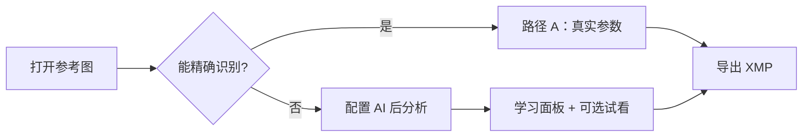
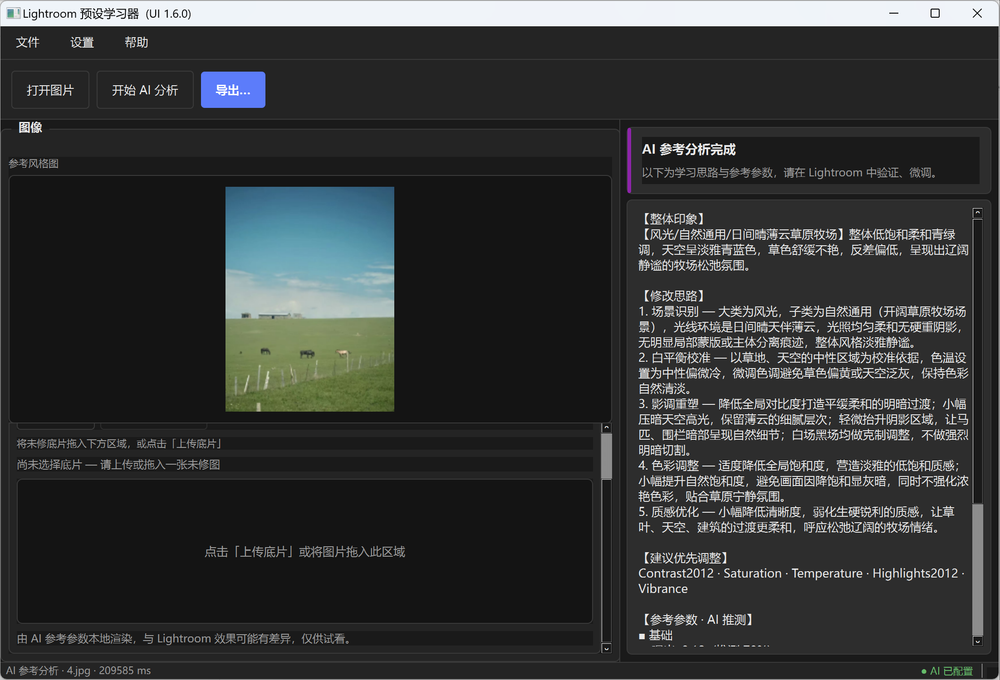
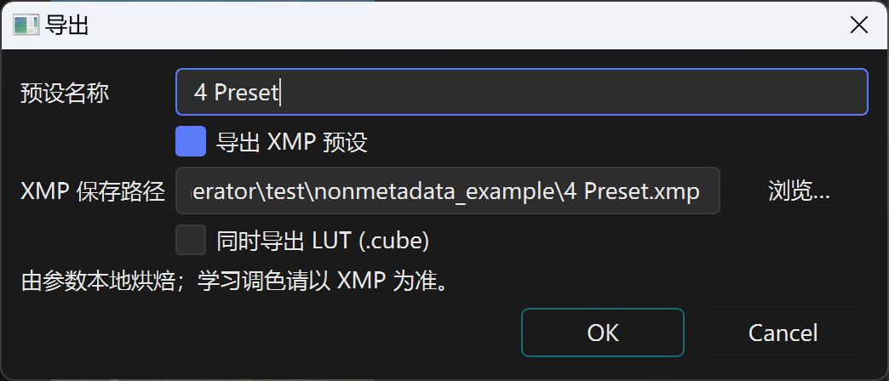
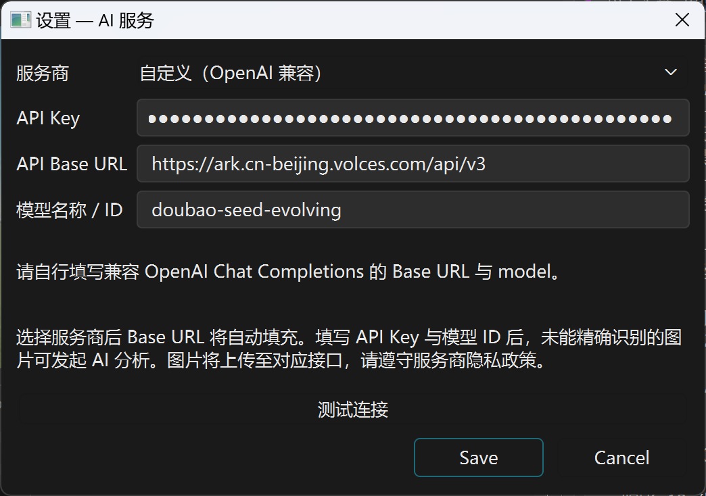
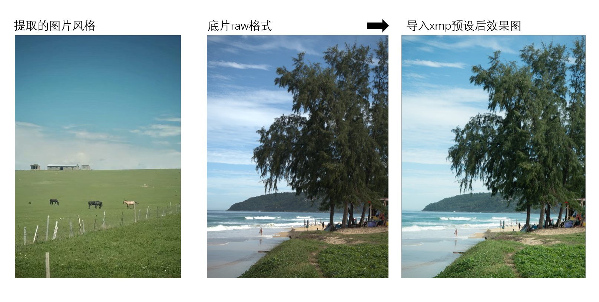

# Lightroom 预设学习器 — 使用指南

**Lightroom Preset Learner — User Guide**

> 面向摄影爱好者的桌面学习工具：从一张**参考成片**学习 Lightroom 调色思路——能读到真实编辑数据时精确提取，读不到时用 AI 生成**参考参数**与可选 LUT 试看。  
> 本指南配图位于同目录，适合在 GitHub 上直接浏览。

| 配图 | 文件名 | 画面内容 |
|------|--------|----------|
| 图一 | [`welcome_p1.png`](welcome_p1.png) | 主窗口：路径 B，AI 分析已完成 |
| 图二 | [`export-dialog.png`](export-dialog.png) | **导出** 对话框 |
| 图三 | [`ai_api.png`](ai_api.png) | **设置 → AI 服务** 对话框 |
| 效果展示 | [`effect-showcase.png`](effect-showcase.png) | 胶片风格提取 → 导出 XMP → 在 LR 中应用前后对比 |

---

## 目录

- [1. 软件能做什么](#1-软件能做什么)
- [2. 安装与启动](#2-安装与启动)
- [3. 主界面总览](#3-主界面总览)
- [4. 主界面：AI 分析完成（图一）](#4-主界面ai-分析完成图一)
- [5. 导出预设（图二）](#5-导出预设图二)
- [6. AI 服务设置（图三）](#6-ai-服务设置图三)
- [7. 路径 A：精确识别](#7-路径-a精确识别)
- [8. 底片 LUT 试看](#8-底片-lut-试看)
- [9. 推荐使用流程](#9-推荐使用流程)
- [10. 常见问题](#10-常见问题)
- [11. 效果展示](#11-效果展示)

---

## 1. 软件能做什么

本软件提供两条学习路径，**不会**在未经确认的情况下自动写文件到磁盘：

| 路径 | 何时触发 | 你需要准备什么 | 得到什么 |
|------|----------|----------------|----------|
| **路径 A — 精确识别** | 参考图仍含 Lightroom 编辑数据 | 无需 API | 真实 Camera Raw 参数 → 导出 XMP |
| **路径 B — AI 辅助学习** | 未能精确识别编辑数据 | OpenAI 兼容 Vision API（自备 Key） | 风格解读 + 参考参数 → 可选 XMP / LUT + 底片试看 |



**学习请以 XMP 为准。** LUT 试看为本地近似渲染，与 Lightroom 最终效果可能有差异。

---

## 2. 安装与启动

**环境：** Python 3.10+，Windows 推荐（提供 `run.bat`）。

```bat
run.bat
```

脚本会自动创建虚拟环境、安装依赖并启动程序。更完整的安装说明见仓库根目录 [README.zh-CN.md](../README.zh-CN.md)。

**路径 A** 无需任何 API Key 即可完整使用。  
**路径 B** 需先在 [§6 AI 服务设置](#6-ai-服务设置图三) 中填写 Key 与模型。

---

## 3. 主界面总览

主窗口分为上、中、下三层：

```
┌─────────────────────────────────────────────────────────────┐
│ 菜单：文件 · 设置 · 帮助                                      │
│ 工具栏：[ 打开图片 ] [ 开始 AI 分析 ] [ 导出… ]                │
├──────────────────────────┬──────────────────────────────────┤
│ 左栏「图像」              │ 右栏                              │
│  · 参考风格图（上）       │  · 状态卡片（绿/红/分析中）        │
│  · 在自己的底片上试看（下）│  · 学习面板（思路与参数列表）      │
├──────────────────────────┴──────────────────────────────────┤
│ 状态栏：当前任务说明                    ● AI 已配置 / 未配置   │
└─────────────────────────────────────────────────────────────┘
```

| 区域 | 作用 |
|------|------|
| **工具栏** | 三个主操作：打开参考图、触发 AI、导出 |
| **左栏 · 参考风格图** | 显示你打开的成片；支持拖入 JPG / PNG / WebP |
| **左栏 · 底片试看** | 仅路径 B 且 AI 完成后可用；路径 A 时整块隐藏 |
| **右栏 · 状态卡片** | 一句话说明当前处于「精确识别 / 待 AI / 分析中 / AI 完成」 |
| **右栏 · 学习面板** | 详细文字：欢迎说明、AI 思路、参数表（可滚动） |
| **状态栏右侧** | AI 是否已配置；点击可打开设置 |

---

## 4. 主界面：AI 分析完成（图一）



*图一：已打开参考图 `4.jpg`（草原风光），AI 分析完成；右栏展示学习结果；底片试看区已启用上传，尚未选择底片。*

图一对应路径 B 的典型工作状态，各区域说明如下。

### 4.1 工具栏与菜单

| 控件 | 说明 |
|------|------|
| **打开图片** | 更换参考风格图 |
| **开始 AI 分析** | 对「未能精确识别」的图发起分析；本图已完成，通常无需再次点击 |
| **导出…** | 打开导出对话框，保存 XMP / 可选 LUT（见 [§5](#5-导出预设图二)） |
| **文件 / 设置 / 帮助** | 导出、AI 设置、关于等辅助入口 |

### 4.2 左栏 — 参考风格图

上方大图即为当前**参考风格图**。本例为网络或普通 JPG，程序未能读到内嵌 LR 编辑数据，因此走路径 B。

支持将图片**拖入窗口**或点击 **打开图片** 载入。

### 4.3 左栏 — 在自己的底片上试看

AI 完成后，此区域顶栏会出现：

- **上传底片** — 选择未修 JPG / PNG / WebP，或拖入下方区域  
- **应用 LUT 预览** — 选好底片后，用 AI 参数本地渲染试看（本图尚未选底片，故右格仍为占位）  
- 说明行：「将未修底片拖入下方区域，或点击「上传底片」」

底片试看详细步骤见 [§8](#8-底片-lut-试看)。

### 4.4 右栏 — 状态卡片

标题 **「AI 参考分析完成」**，副标题提醒：以下为参考值，请在 Lightroom 中验证、微调。

### 4.5 右栏 — 学习面板

可**向下滚动**阅读全文，通常包含：

| 区块 | 本图示例内容 |
|------|----------------|
| **【整体印象】** | 识别为自然光草原风光；低饱和、柔和蓝绿色调 |
| **【修改思路】** | 五步：场景识别 → 白平衡 → 层次 → 色彩 → 质感 |
| **【建议优先调整】** | Contrast2012、Saturation、Temperature、Highlights2012、Vibrance 等 |
| **【参考参数 · AI 推测】** | 分组列出曝光、对比度、色温等数值与置信度 |

### 4.6 状态栏

- 左侧：`AI 参考分析 · 4.jpg · … ms` — 当前模式、文件名与耗时  
- 右侧：**● AI 已配置**（绿色）— API 已就绪

---

## 5. 导出预设（图二）



*图二：点击工具栏 **导出…** 后打开的对话框。*

分析完成（路径 A 或路径 B）后即可导出。**只有点击 Save 确认后才会写入磁盘。**

### 5.1 对话框字段

| 字段 | 说明 |
|------|------|
| **预设名称** | 写入 XMP 的预设名；本例为 `4 Preset` |
| **导出 XMP 预设** | 默认勾选；路径 A 为精确参数，路径 B 为 AI 参考参数 |
| **XMP 保存路径** | 点击 **浏览…** 选择 `.xmp` 保存位置 |
| **同时导出 LUT (.cube)** | 可选；由参数本地烘焙 |
| **LUT 保存路径** | 勾选 LUT 后出现；选择 `.cube` 路径 |

底部提示：**由参数本地烘焙；学习调色请以 XMP 为准。**

### 5.2 操作

1. 确认预设名称与保存路径。  
2. 按需勾选是否同时导出 LUT。  
3. 点击 **Save** 保存，或 **Cancel** 取消。

导出完成后，在 **Adobe Lightroom Classic** 中通过「预设 → 导入」载入 XMP，对照学习面板中的参数与思路进行微调。

---

## 6. AI 服务设置（图三）



*图三：菜单 **设置 → AI 服务…**。本例为火山方舟（豆包）自定义兼容配置。*

路径 B 使用前须完成此项配置（路径 A 可跳过）。

### 6.1 填写项说明

| 字段 | 说明 |
|------|------|
| **服务商** | 下拉预设：**OpenAI 官方**、**火山方舟（豆包）**、**自定义（OpenAI 兼容）** |
| **API Key** | 必填；留空可尝试环境变量 `OPENAI_API_KEY` |
| **API Base URL** | 选预设后自动填充；本例为 `https://ark.cn-beijing.volces.com/api/v3` |
| **模型名称 / ID** | 须支持视觉；本例为 `doubao-seed-evolving` |

### 6.2 推荐配置示例

| 服务商 | Base URL（预设） | 模型示例 |
|--------|------------------|----------|
| OpenAI | `https://api.openai.com/v1` | `gpt-4o` |
| 火山方舟 | `https://ark.cn-beijing.volces.com/api/v3` | `doubao-seed-evolving` 等 |
| 自定义 | 按网关文档 | 按网关文档 |

> 本程序使用 **OpenAI 兼容** `POST …/chat/completions`。请勿填入 Anthropic `/api/compatible` 类地址。

### 6.3 保存前建议

1. 点击 **测试连接** 验证 Key 与模型。  
2. 点击 **Save** 保存；主窗口状态栏应显示 **● AI 已配置**。  
3. 配置保存在本地 `config/ai_config.local.yaml`（**不会**上传到 GitHub）。

---

## 7. 路径 A：精确识别

当参考图为 **Lightroom 导出且仍含编辑数据**（内嵌 XMP 或同目录 sidecar `.xmp`）时，打开图片后**自动**走路径 A，**无需 AI**。

界面布局与图一相同，但会有这些区别：

| 项目 | 路径 A 表现 |
|------|-------------|
| 状态卡片 | 绿色 **「已精确识别 Lightroom 编辑数据」** |
| 学习面板 | 展示分组后的**真实** Camera Raw 参数 |
| **开始 AI 分析** | 禁用（无需 AI） |
| **底片试看区** | **整段隐藏** |
| 导出 | XMP 为精确预设（图二对话框同样适用） |

典型流程：**打开 LR 导出图 → 查看参数 → 导出… → 在 Lightroom 中导入 XMP 对照学习**。

---

## 8. 底片 LUT 试看

路径 B 专属功能（图一左栏下半部分）。在 AI 分析完成后：

1. 点击 **上传底片**，或将未修图拖入预览区。  
2. 状态行显示「已选：文件名」。  
3. 点击 **应用 LUT 预览**，左侧为**底片**，右侧为**试看效果**。  
4. 脚注说明：本地渲染，与 Lightroom 效果可能有差异，仅供试看。

**按钮启用顺序：** AI 完成前均禁用 → AI 完成后可上传 → 有底片后可应用 LUT。

路径 A 不显示此区域。

---

## 9. 推荐使用流程

### 流程 A — 我有 Lightroom 导出的成片

1. 启动程序 → **打开图片**（LR 导出 JPG/TIFF）。  
2. 若显示 **已精确识别** → 阅读参数 → **导出…**（图二）→ 在 LR 中导入对照。  
3. 无需配置 AI。

### 流程 B — 我只有网络参考图 / 无编辑数据

1. **设置 → AI 服务**（图三）填写 Key 与模型 → 测试连接 → Save。  
2. **打开图片**（参考风格图）。  
3. 若显示 **未能精确识别** → 点击 **开始 AI 分析**。  
4. 阅读右栏思路与参数（图一）→ 可选：上传底片 → 应用 LUT 试看。  
5. **导出…**（图二）保存参考 XMP（及可选 LUT）。  
6. 在 Lightroom 中导入 XMP，按思路微调。

### 支持的图片格式

参考图与底片均支持：**JPG / JPEG / PNG / WebP**（部分环境亦支持 TIFF）。

---

## 10. 常见问题

| 现象 | 说明与处理 |
|------|------------|
| 一直是「未能精确识别」 | 图片可能已被平台重压缩或 stripped；属正常，请走路径 B |
| 「开始 AI 分析」灰色 | 先按图三配置 AI；或当前图已精确识别（路径 A） |
| Banner「AI 未配置」 | 路径 B 预期提示；路径 A 不影响使用 |
| AI 分析失败 | 检查 Key、Base URL、模型 ID；火山方舟须用 `/api/v3` 且模型已在控制台开通 |
| 试看与 LR 不一致 | 预期行为；请以导出的 XMP 在 LR 中学习 |
| 导出按钮不可用 | 须先完成精确识别或 AI 分析 |

---

## 11. 效果展示



本例以一张**胶片感草原风光**为参考，通过 AI 分析模拟其色调与质感，导出 XMP 预设后，在 Lightroom 中对另一张**海滩 RAW 底片**导入该预设。成片在色彩倾向与整体氛围上接近参考图，说明从「学习风格 → 输出参数 → 实际套用」的完整链路可以走通。

图中从左至右依次为：**提取的图片风格**（参考）→ **底片 RAW**（未处理）→ **导入 XMP 预设后效果图**。

---

## 相关文档

| 文档 | 内容 |
|------|------|
| [README.zh-CN.md](../README.zh-CN.md) | 项目介绍、安装、路线图 |
| [README.md](../README.md) | English overview |
| [docs/PRODUCT_SPEC_v2.md](../docs/PRODUCT_SPEC_v2.md) | 产品功能与验收 |
| [docs/UI_UX_DESIGN.md](../docs/UI_UX_DESIGN.md) | 界面与交互设计 |

---

<p align="center"><sub>Lightroom 为 Adobe Inc. 商标。本项目与 Adobe 无关联。</sub></p>
